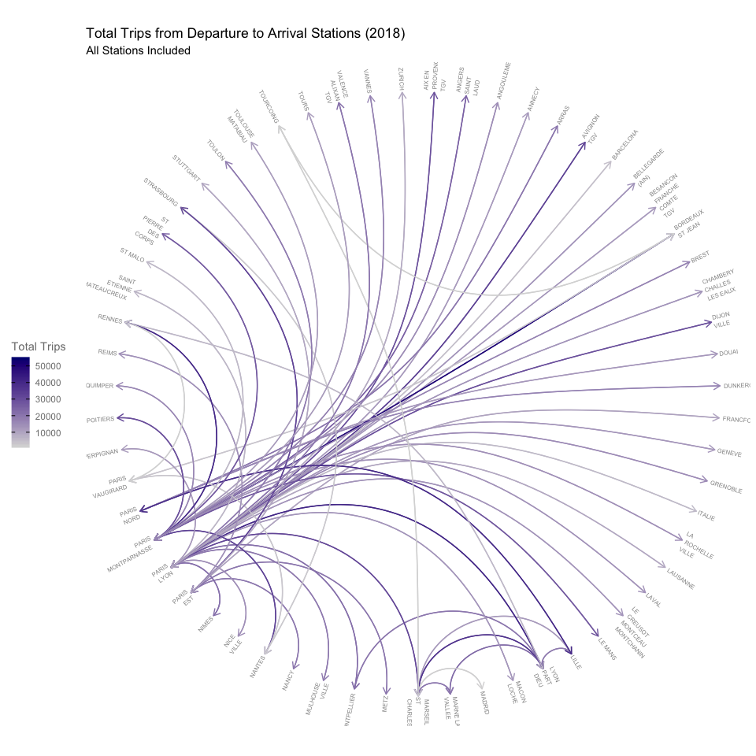
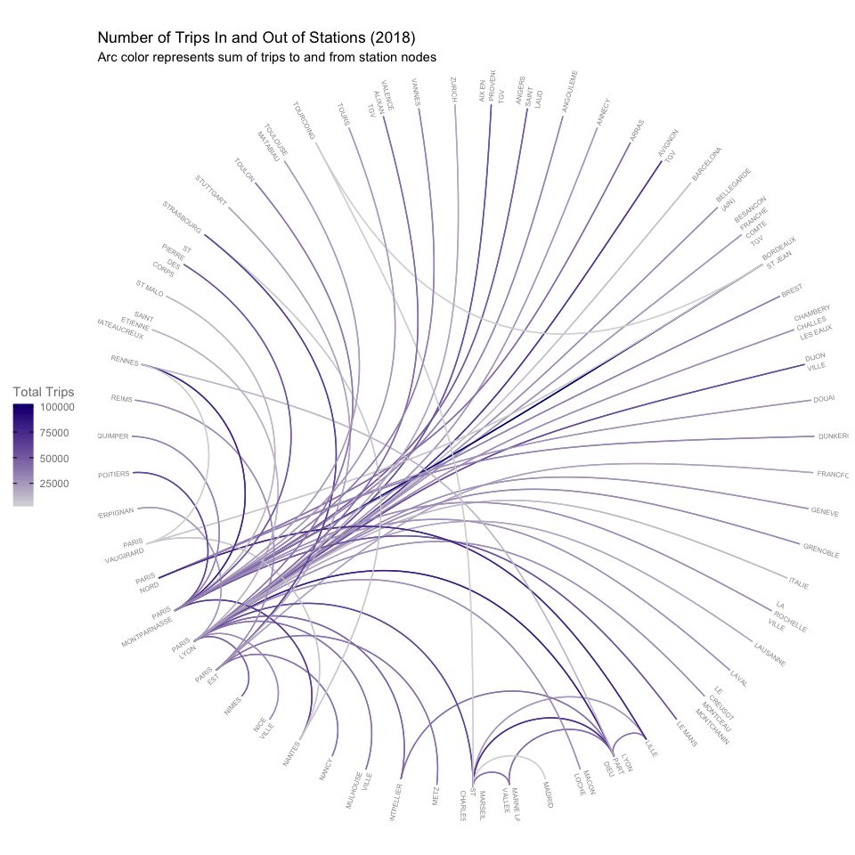

France Trains
================
Nancy Huynh
2019-02-28

-   [France Trains Data - TidyTuesday](#france-trains-data---tidytuesday)
    -   [Data Imports and Libraries](#data-imports-and-libraries)
        -   [Quick Look at Data](#quick-look-at-data)
        -   [Looking at Total Number of Trips in 2018](#looking-at-total-number-of-trips-in-2018)

France Trains Data - TidyTuesday
================================

With this TidyTuesday dataset I learned how to make a circular network chart. I also learned some of the possible downsides to this type of chart particularly when using colored arcs to represent a variable and the issue of overlapping arcs. For the dataset head over to [TidyTuesday](https://github.com/rfordatascience/tidytuesday/tree/master/data/2019/2019-02-26)

Data Imports and Libraries
--------------------------

``` r
#LOAD LIBRARIES
library(tidyverse)
library(igraph) # for circular network graph
library(ggraph) # for circular network graph
```

``` r
#LOAD DATA
trains <- readr::read_csv("https://raw.githubusercontent.com/rfordatascience/tidytuesday/master/data/2019/2019-02-26/small_trains.csv")
```

### Quick Look at Data

Check out the structure of the data and what the most recent data is. Latest data is from November 2018.

``` r
str(trains, give.attr = FALSE)
```

    ## Classes 'spec_tbl_df', 'tbl_df', 'tbl' and 'data.frame': 32772 obs. of  13 variables:
    ##  $ year                   : num  2017 2017 2017 2017 2017 ...
    ##  $ month                  : num  9 9 9 9 9 9 9 9 9 9 ...
    ##  $ service                : chr  "National" "National" "National" "National" ...
    ##  $ departure_station      : chr  "PARIS EST" "REIMS" "PARIS EST" "PARIS LYON" ...
    ##  $ arrival_station        : chr  "METZ" "PARIS EST" "STRASBOURG" "AVIGNON TGV" ...
    ##  $ journey_time_avg       : num  85.1 47.1 116.2 161.1 164.5 ...
    ##  $ total_num_trips        : num  299 218 333 481 190 191 208 216 661 201 ...
    ##  $ avg_delay_all_departing: num  0.752 1.264 1.139 1.406 1.729 ...
    ##  $ avg_delay_all_arriving : num  0.42 1.14 1.59 4.79 6.01 ...
    ##  $ num_late_at_departure  : num  15 10 20 36 16 18 49 24 141 23 ...
    ##  $ num_arriving_late      : num  17 23 19 61 38 18 38 37 122 26 ...
    ##  $ delay_cause            : chr  "delay_cause_external_cause" "delay_cause_external_cause" "delay_cause_external_cause" "delay_cause_external_cause" ...
    ##  $ delayed_number         : num  0.25 0.25 0.214 0.155 0.167 ...

``` r
trains %>% 
  arrange(desc(year), desc(month)) %>%
  head()
```

    ## # A tibble: 6 x 13
    ##    year month service departure_stati… arrival_station journey_time_avg
    ##   <dbl> <dbl> <chr>   <chr>            <chr>                      <dbl>
    ## 1  2018    11 <NA>    ANGOULEME        PARIS MONTPARN…             128.
    ## 2  2018    11 <NA>    PARIS MONTPARNA… BORDEAUX ST JE…             145.
    ## 3  2018    11 <NA>    BORDEAUX ST JEAN PARIS MONTPARN…             144.
    ## 4  2018    11 <NA>    PARIS MONTPARNA… BREST                       223.
    ## 5  2018    11 <NA>    BREST            PARIS MONTPARN…             228.
    ## 6  2018    11 <NA>    PARIS MONTPARNA… LA ROCHELLE VI…             168.
    ## # … with 7 more variables: total_num_trips <dbl>,
    ## #   avg_delay_all_departing <dbl>, avg_delay_all_arriving <dbl>,
    ## #   num_late_at_departure <dbl>, num_arriving_late <dbl>,
    ## #   delay_cause <chr>, delayed_number <dbl>

### Looking at Total Number of Trips in 2018

Taking a look at total number of trips variable `total_num_trips` in 2018. The route with the most trips in 2018 is from BORDEAUX ST JEAN to PARIS MONTPARNASSE. Note from the printout for the tibble size that there were 130 routes in 2018.

``` r
routes_2018 <- trains %>% filter(year == 2018) %>%
  group_by(departure_station, arrival_station) %>%
  summarise(total_trips = sum(total_num_trips))

routes_2018 %>%  
  arrange(total_trips)
```

    ## # A tibble: 130 x 3
    ## # Groups:   departure_station [59]
    ##    departure_station    arrival_station      total_trips
    ##    <chr>                <chr>                      <dbl>
    ##  1 TOURCOING            BORDEAUX ST JEAN            1680
    ##  2 BORDEAUX ST JEAN     TOURCOING                   1698
    ##  3 TOURCOING            MARSEILLE ST CHARLES        1782
    ##  4 MARSEILLE ST CHARLES MADRID                      1824
    ##  5 MARSEILLE ST CHARLES TOURCOING                   1836
    ##  6 PARIS VAUGIRARD      RENNES                      1836
    ##  7 RENNES               PARIS VAUGIRARD             1842
    ##  8 MADRID               MARSEILLE ST CHARLES        1854
    ##  9 STRASBOURG           NANTES                      3012
    ## 10 NANTES               STRASBOURG                  3036
    ## # … with 120 more rows

I saw a pretty cool circular network chart on this dataset from [@WireMonkey](https://twitter.com/WireMonkey/status/1100932771122421762) and wanted to learn how to make something similar just for the total trips in 2018 from departure to arrival stations. After figuring out how to do it something bothered me with the chart. My issue with this chart is that it's hard to distinguish the correct color for overlapping arcs. For example Paris Nord to Lille, and Lille to Paris Nord, the arcs overlap and I can't tell if the color of the arc represents the former or latter departure-arrival pair. It loooks pretty cool, and we can tell quickly which stations have the most routes, but not sure if its the best to determine total trips.

``` r
routes_2018 <- routes_2018 %>%
  arrange(departure_station)

## Function to create circular network graph so I can reuse it below instead of copying pasting everything
circle_graph <- function(data) {
net_graph <- graph_from_data_frame(data, directed = TRUE)

## Figure out the angles for each label so they are easily legible
# create layout to access index to determine angles
layout <- create_layout(net_graph, layout = "linear", circular = TRUE)
# calculate angles and adjustments for labels
V(net_graph)$angle <- 90 - 360 * (layout$ggraph.index-0.5) / max(layout$ggraph.index)
V(net_graph)$hjust <- ifelse(V(net_graph)$angle < -90, 1.1, -0.1)
V(net_graph)$angle <- ifelse(V(net_graph)$angle < -90, V(net_graph)$angle+180, V(net_graph)$angle)

## Create circular network graph
chart <- net_graph %>%
  ggraph(layout = "linear", circular = TRUE) +
  geom_node_point(alpha = 0) +
  geom_node_text(aes(label = str_wrap(name, 8), angle = angle, hjust = hjust), size = 2, alpha = 0.5) +
  scale_edge_color_gradient(low = "grey85", high = "navyBlue") +
  coord_fixed() +
  theme(axis.title = element_blank(),
        axis.text = element_blank(),
        axis.ticks = element_blank(),
        panel.background = element_rect(fill = "white"),
        legend.text = element_text(color = "grey50"),
        legend.title = element_text(color = "grey50"),
        legend.position = "left")

return(chart)
}

circle_graph(routes_2018) +
  geom_edge_arc(aes(color = total_trips), arrow = arrow(length = unit(0.10, "inches"))) +
  labs(edge_color = "Total Trips",
       title = "Total Trips from Departure to Arrival Stations (2018)",
       subtitle = "All Stations Included")
```



The only reason that I'm "ok" with the chart is that the largest absolute difference between a departure-arrival pair and its reverse pair is 5508. This might be a fairly large number, but when it comes to the color scaling a difference of 5000 trips is not *that* distinguishable.

``` r
## Find the reverse number of trips and calculate the absoluate difference
routes_2018_dup <- routes_2018 %>%
  rename(rev_trips = total_trips)

left_join(routes_2018, routes_2018_dup, by = c("arrival_station" = "departure_station", "departure_station" = "arrival_station")) %>%
  mutate(difference = abs(total_trips - rev_trips)) %>%
  arrange(desc(difference))
```

    ## # A tibble: 130 x 5
    ## # Groups:   departure_station [59]
    ##    departure_station  arrival_station    total_trips rev_trips difference
    ##    <chr>              <chr>                    <dbl>     <dbl>      <dbl>
    ##  1 BORDEAUX ST JEAN   PARIS MONTPARNASSE       54270     48762       5508
    ##  2 PARIS MONTPARNASSE BORDEAUX ST JEAN         48762     54270       5508
    ##  3 AVIGNON TGV        PARIS LYON               36648     32274       4374
    ##  4 PARIS LYON         AVIGNON TGV              32274     36648       4374
    ##  5 MONTPELLIER        PARIS LYON               25314     21120       4194
    ##  6 PARIS LYON         MONTPELLIER              21120     25314       4194
    ##  7 LYON PART DIEU     MARNE LA VALLEE          19134     23040       3906
    ##  8 MARNE LA VALLEE    LYON PART DIEU           23040     19134       3906
    ##  9 NIMES              PARIS LYON               25356     21504       3852
    ## 10 PARIS LYON         NIMES                    21504     25356       3852
    ## # … with 120 more rows

The alternative might be to calculate the total trips going in and out of the two stations and then the colored arcs would represents all trips coming and going between the two stations. Although apart from the change in basically doubling the values on the color scale the charts look the same.

``` r
routes_2018_new <- routes_2018 %>%
  left_join(routes_2018_dup, by = c("arrival_station" = "departure_station", "departure_station" = "arrival_station")) %>%
  mutate(total_trips = total_trips + rev_trips) %>%
  select(departure_station, arrival_station, total_trips) %>%
  arrange(departure_station)

circle_graph(routes_2018_new) +
    geom_edge_arc(aes(color = total_trips)) +
  labs(edge_color = "Total Trips",
         title = "Number of Trips In and Out of Stations (2018)",
         subtitle = "Arc color represents sum of trips to and from station nodes")
```


