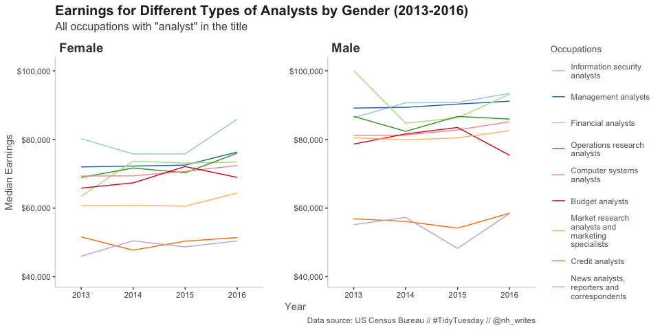
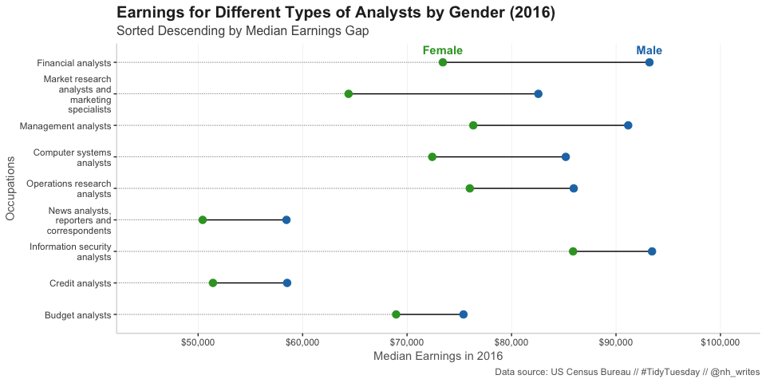

Women in the Workforce
================
Nancy Huynh
2019-03-06

-   [Women in the Workforce (US)](#women-in-the-workforce-us)
    -   [Libraries and Data Import](#libraries-and-data-import)
        -   [Quick Look at Data and Variables](#quick-look-at-data-and-variables)
        -   [Where the "Analysts" at?](#where-the-analysts-at)
    -   [BTW and Thanks 🙏](#btw-and-thanks)

Women in the Workforce (US)
===========================

This week's TidyTuesday dataset is aptly in line with International Women's Day (March 8) and Women's History month. Find the data here on the [tidytuesday repo](https://github.com/rfordatascience/tidytuesday/tree/master/data/2019/2019-03-05). There's three data files, the one I'm using below comes from the US Census Bureau. *Side note: This might be an apt time to highlight that Viola Desmond, Canadian activist, is [featured on our $10 bill](https://www.theglobeandmail.com/canada/article-viola-desmond-10-bill-explainer/).* 🇨🇦

Libraries and Data Import
-------------------------

``` r
library(tidyverse)
library(skimr)
library(scales)
library(RColorBrewer)
```

``` r
jobs_gender <- readr::read_csv("https://raw.githubusercontent.com/rfordatascience/tidytuesday/master/data/2019/2019-03-05/jobs_gender.csv")
```

    ## Parsed with column specification:
    ## cols(
    ##   year = col_double(),
    ##   occupation = col_character(),
    ##   major_category = col_character(),
    ##   minor_category = col_character(),
    ##   total_workers = col_double(),
    ##   workers_male = col_double(),
    ##   workers_female = col_double(),
    ##   percent_female = col_double(),
    ##   total_earnings = col_double(),
    ##   total_earnings_male = col_double(),
    ##   total_earnings_female = col_double(),
    ##   wage_percent_of_male = col_double()
    ## )

### Quick Look at Data and Variables

Recently learned about the `skimr` package at the kickoff R Ladies Toronto meetup this week from [Sharla Gelfand](https://sharla.party/talks/rladies-rug-kickoff.html#1). Note: the `skimr` package is maintained by by Elin Waring and Michael Quinn. Decided to give `skimr` a try. It was handy to see the number of unique values for the `major_category`, `minor_category`, and `occupation` variables. Also handy is the missing values column.

``` r
glimpse(jobs_gender)
```

    ## Observations: 2,088
    ## Variables: 12
    ## $ year                  <dbl> 2013, 2013, 2013, 2013, 2013, 2013, 2013, …
    ## $ occupation            <chr> "Chief executives", "General and operation…
    ## $ major_category        <chr> "Management, Business, and Financial", "Ma…
    ## $ minor_category        <chr> "Management", "Management", "Management", …
    ## $ total_workers         <dbl> 1024259, 977284, 14815, 43015, 754514, 441…
    ## $ workers_male          <dbl> 782400, 681627, 8375, 17775, 440078, 16141…
    ## $ workers_female        <dbl> 241859, 295657, 6440, 25240, 314436, 28057…
    ## $ percent_female        <dbl> 23.6, 30.3, 43.5, 58.7, 41.7, 63.5, 33.6, …
    ## $ total_earnings        <dbl> 120254, 73557, 67155, 61371, 78455, 74114,…
    ## $ total_earnings_male   <dbl> 126142, 81041, 71530, 75190, 91998, 90071,…
    ## $ total_earnings_female <dbl> 95921, 60759, 65325, 55860, 65040, 66052, …
    ## $ wage_percent_of_male  <dbl> 76.04208, 74.97316, 91.32532, 74.29179, 70…

``` r
skim(jobs_gender)
```

    ## Skim summary statistics
    ##  n obs: 2088 
    ##  n variables: 12 
    ## 
    ## ── Variable type:character ───────────────────────────────────────────────────────────────────────────────────────────────────
    ##        variable missing complete    n min max empty n_unique
    ##  major_category       0     2088 2088   7  52     0        8
    ##  minor_category       0     2088 2088   5  46     0       23
    ##      occupation       0     2088 2088   5 156     0      522
    ## 
    ## ── Variable type:numeric ─────────────────────────────────────────────────────────────────────────────────────────────────────
    ##               variable missing complete    n      mean        sd       p0
    ##         percent_female       0     2088 2088     36        27.49     0   
    ##         total_earnings       0     2088 2088  49762.09  22926.69 17266   
    ##  total_earnings_female      65     2023 2088  44681.04  21280.84  7447   
    ##    total_earnings_male       4     2084 2088  53138.06  24765.76 12147   
    ##          total_workers       0     2088 2088  2e+05    375361.03   658   
    ##   wage_percent_of_male     846     1242 2088     84.03      9.38    50.87
    ##         workers_female       0     2088 2088  84539.51 212696.02     0   
    ##           workers_male       0     2088 2088 111515.36 233154.43     0   
    ##                   year       0     2088 2088   2014.5       1.12  2013   
    ##       p25      p50       p75      p100     hist
    ##     10.73    32.4      57.31     100   ▇▅▃▃▃▂▂▁
    ##  32410    44437     61012      2e+05   ▇▇▃▁▁▁▁▁
    ##  28872    40191     54813     166388   ▅▇▅▂▁▁▁▁
    ##  35701.5  46825     65015     231420   ▆▇▃▁▁▁▁▁
    ##  18687    58997    187415.25 3758629   ▇▁▁▁▁▁▁▁
    ##     77.56    85.16     90.62     117.4 ▁▁▃▆▇▃▁▁
    ##   2364.5  15238.5   63326.5  2290818   ▇▁▁▁▁▁▁▁
    ##  10764.75 32301.5   1e+05    2570385   ▇▁▁▁▁▁▁▁
    ##   2013.75  2014.5    2015.25    2016   ▇▁▇▁▁▇▁▇

``` r
# take a look at which occupations had missing values for the total_earnings_female and total_earnings_male variables
jobs_gender %>%
  filter(is.na(total_earnings_female)) %>%
  group_by(minor_category) %>%
  summarise(n = n())
```

    ## # A tibble: 8 x 2
    ##   minor_category                            n
    ##   <chr>                                 <int>
    ## 1 Architecture and Engineering              1
    ## 2 Construction and Extraction              30
    ## 3 Installation, Maintenance, and Repair    16
    ## 4 Material Moving                           7
    ## 5 Personal Care and Service                 1
    ## 6 Production                                2
    ## 7 Protective Service                        2
    ## 8 Transportation                            6

``` r
jobs_gender %>%
  filter(is.na(total_earnings_male))
```

    ## # A tibble: 4 x 12
    ##    year occupation major_category minor_category total_workers workers_male
    ##   <dbl> <chr>      <chr>          <chr>                  <dbl>        <dbl>
    ## 1  2013 Nurse mid… Healthcare Pr… Healthcare Pr…          2817            0
    ## 2  2014 Nurse mid… Healthcare Pr… Healthcare Pr…          4490            0
    ## 3  2015 Nurse mid… Healthcare Pr… Healthcare Pr…          4171           53
    ## 4  2016 Nurse mid… Healthcare Pr… Healthcare Pr…          4001            0
    ## # … with 6 more variables: workers_female <dbl>, percent_female <dbl>,
    ## #   total_earnings <dbl>, total_earnings_male <dbl>,
    ## #   total_earnings_female <dbl>, wage_percent_of_male <dbl>

The `skimr` output showed 522 unique so I'm not going to print that out, but let's take a look at the major and minor categories.

``` r
# unique major_category
unique(jobs_gender$major_category)
```

    ## [1] "Management, Business, and Financial"                 
    ## [2] "Computer, Engineering, and Science"                  
    ## [3] "Education, Legal, Community Service, Arts, and Media"
    ## [4] "Healthcare Practitioners and Technical"              
    ## [5] "Service"                                             
    ## [6] "Sales and Office"                                    
    ## [7] "Natural Resources, Construction, and Maintenance"    
    ## [8] "Production, Transportation, and Material Moving"

``` r
# unique minor_categories
unique(jobs_gender$minor_category)
```

    ##  [1] "Management"                                    
    ##  [2] "Business and Financial Operations"             
    ##  [3] "Computer and mathematical"                     
    ##  [4] "Architecture and Engineering"                  
    ##  [5] "Life, Physical, and Social Science"            
    ##  [6] "Community and Social Service"                  
    ##  [7] "Legal"                                         
    ##  [8] "Education, Training, and Library"              
    ##  [9] "Arts, Design, Entertainment, Sports, and Media"
    ## [10] "Healthcare Practitioners and Technical"        
    ## [11] "Healthcare Support"                            
    ## [12] "Protective Service"                            
    ## [13] "Food Preparation and Serving Related"          
    ## [14] "Building and Grounds Cleaning and Maintenance" 
    ## [15] "Personal Care and Service"                     
    ## [16] "Sales and Related"                             
    ## [17] "Office and Administrative Support"             
    ## [18] "Farming, Fishing, and Forestry"                
    ## [19] "Construction and Extraction"                   
    ## [20] "Installation, Maintenance, and Repair"         
    ## [21] "Production"                                    
    ## [22] "Transportation"                                
    ## [23] "Material Moving"

### Where the "Analysts" at?

I've been various types of "analysts" over the years so I'm curious to see what the earnings are like for occupations with "analyst" in the occupation name. Since there's no existing category for Analysts, I just filtered them out using `grepl()`. There are 9 unique occupations with Analyst in the name. Interestingly the vague occupation of "Business Analyst" isn't one of them. I did a quick search to see how the US Census came up with the list of occupations but didn't find anything. My best guess is that work titles like "Business Analyst" are lumped into one of the listed occupations—probably "Management analysts". In reality there are probably hundreds of titles with "Analyst", search LinkedIn if you don't believe me.

``` r
# find all occupations with "analyst"" in the name
analyst_jobs <- jobs_gender %>%
  filter(grepl("analyst", occupation))  %>%
  select(year, occupation, minor_category, total_earnings_female, total_earnings_male, total_workers)

analyst_jobs %>%
  arrange(desc(total_workers))
```

    ## # A tibble: 36 x 6
    ##     year occupation minor_category total_earnings_… total_earnings_…
    ##    <dbl> <chr>      <chr>                     <dbl>            <dbl>
    ##  1  2016 Managemen… Business and …            76338            91169
    ##  2  2015 Managemen… Business and …            72526            90316
    ##  3  2013 Managemen… Business and …            72006            89151
    ##  4  2014 Managemen… Business and …            72260            89368
    ##  5  2014 Computer … Computer and …            69406            81294
    ##  6  2016 Computer … Computer and …            72409            85192
    ##  7  2013 Computer … Computer and …            69346            81174
    ##  8  2015 Computer … Computer and …            70706            82774
    ##  9  2016 Market re… Business and …            64398            82565
    ## 10  2014 Market re… Business and …            60798            79902
    ## # … with 26 more rows, and 1 more variable: total_workers <dbl>

``` r
unique(analyst_jobs$occupation)
```

    ## [1] "Management analysts"                               
    ## [2] "Market research analysts and marketing specialists"
    ## [3] "Budget analysts"                                   
    ## [4] "Credit analysts"                                   
    ## [5] "Financial analysts"                                
    ## [6] "Computer systems analysts"                         
    ## [7] "Information security analysts"                     
    ## [8] "Operations research analysts"                      
    ## [9] "News analysts, reporters and correspondents"

Let's see how the median earnings of these "Analyst" occupations have changed over time. And split by female vs male. There's some trends here. But the one that this particular, slightly messy, chart highlights just because of the position of the lines is the difference for earnings between female and male for 'Market research analysts and marketing specialists'.

``` r
nh_theme <- theme(panel.background = element_rect(fill = "white"),
          strip.background = element_blank(),
          strip.text = element_text(hjust = 0, size = 14, color = "grey25", face = "bold"),
          panel.spacing = unit(2, "lines"),
          axis.line = element_line(color = "grey85"),
          legend.key = element_blank(),
          legend.key.height = unit(1, "cm"),
          legend.title = element_text(size = "10"),
          plot.title = element_text(size = 15, color = "grey15", face = "bold"),
          plot.subtitle = element_text(size = 12, color = "grey30"),
          text = element_text(color = "grey40"))

analyst_jobs %>%
  select(year, occupation, total_earnings_female, total_earnings_male) %>%
  gather(key = "gender", value = "total_earnings", -year, -occupation) %>%
  mutate(
    gender = case_when(
      gender == "total_earnings_female" ~ "Female",
      gender == "total_earnings_male" ~ "Male"
    )) %>%
  ggplot(aes(x = year, y = total_earnings, color = fct_reorder(str_wrap(occupation, 20), -total_earnings))) +
    geom_line() +
    # show both x and y axis when faceting by setting to scales = "free"
    facet_wrap(~ gender, scales = "free") +
    scale_color_brewer(palette = "Paired", name = "Occupations") +
    # set limits to y-axis so that both y axis line up with each other
    # format axis labels to show $
    scale_y_continuous(labels = scales::comma_format(prefix = "$"), limits = c(40000, 101000), name = "Median Earnings") +
    # give some padding around the year axis, but also make sure the breaks are on the years
    scale_x_continuous(breaks = c(2013:2016), expand = c(0, 0.5), name = "Year") +
    nh_theme +
    labs(title = "Earnings for Different Types of Analysts by Gender (2013-2016)",
       subtitle = "All occupations with \"analyst\" in the title",
       caption = "Data source: US Census Bureau // #TidyTuesday // @nh_writes")
```



It's hard to tell exactly what the earnings gap is between female and male for each of the positions so here's a dumbbell chart of 2016 earnings for the 9 analyst occupations. I sorted it by median earnings gap between female and male. It was hard to tell in the line chart what the gap is, except for those 'Market research analysts and marketing specialists'. In this one we can see that in 2016 the biggest gap is between female and male financial analysts. For the most part, the gap is larger for occupations with earnings toward the higher end. *Note: Dumbbell chart inspired by tweet from [@rcammisola](https://twitter.com/rcammisola/status/1103351691993382912)*

``` r
library(ggalt) # for geom_dumbbell

colors <- brewer.pal(4, "Paired")

analyst_jobs %>%
  filter(year == 2016) %>%
  mutate(occupation = fct_reorder(str_wrap(occupation, 20), (total_earnings_male - total_earnings_female))) %>%
  ggplot(aes(x = total_earnings_female, xend = total_earnings_male, y = occupation, yend = occupation)) +
  geom_dumbbell(colour_x = colors[4], colour_xend = colors[2], size_x = 3, size_xend = 3, dot_guide = TRUE, dot_guide_size = 0.25) +
  geom_text(data = filter(analyst_jobs, year == 2016, occupation == "Financial analysts"), aes(x = total_earnings_female, y = occupation, label="Female"), vjust = -1, color = colors[4], fontface = "bold") +
  geom_text(data = filter(analyst_jobs, year == 2016, occupation == "Financial analysts"), aes(x = total_earnings_male, y = occupation, label="Male"), vjust = -1,  color = colors[2], fontface = "bold") +
  scale_x_continuous(labels = scales::comma_format(prefix = "$"), limits = c(45000, 101000), breaks = seq(50000, 100000, 10000), name = "Median Earnings in 2016") +
  scale_y_discrete(name = "Occupations") +
  nh_theme +
  theme(panel.grid.major.x = element_line(size = 0.1, color = "grey85")) +
  labs(title = "Earnings for Different Types of Analysts by Gender (2016)",
      subtitle = "Sorted Descending by Median Earnings Gap",
      caption = "Data source: US Census Bureau // #TidyTuesday // @nh_writes")
```



BTW and Thanks 🙏
----------------

I had no idea what a dumbbell chart was until I started checking out what other people were doing for [\#TidyTuesday](https://twitter.com/search?q=%23TidyTuesday&src=tyah). Also found out what a slope graph is, maybe I'll try that out for another TidyTuesday. Big thanks to the \#TidyTuesday and \#rstats community!
