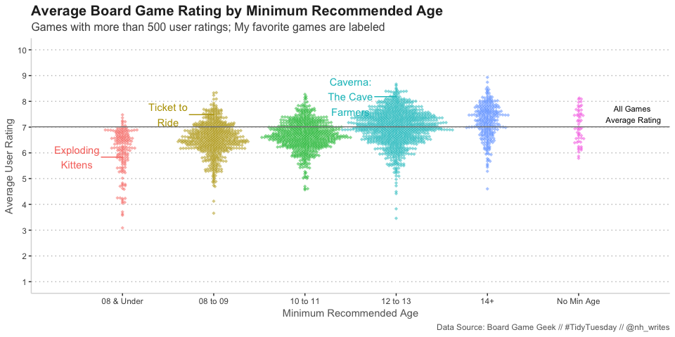
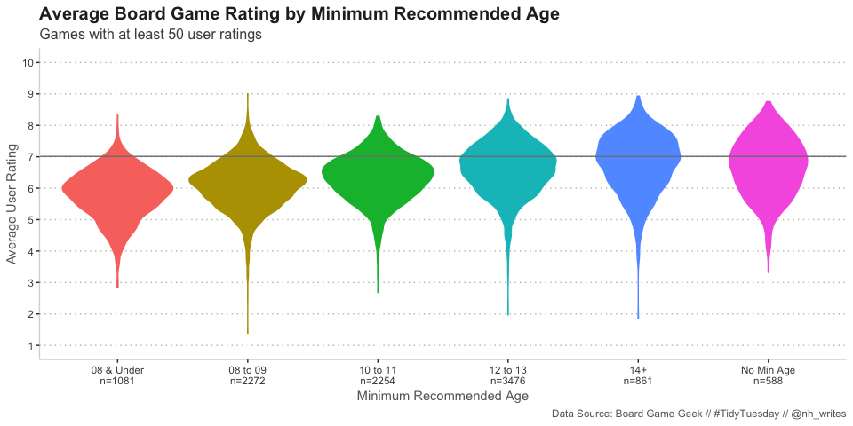
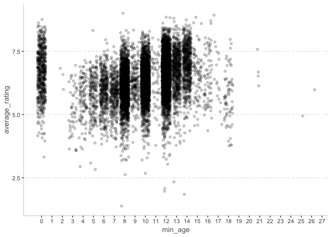

Board Games Database
================
Nancy Huynh
2019-03-12

-   [Board Games Database (Board Game Geek)](#board-games-database-board-game-geek)
    -   [Libraries and Data Import](#libraries-and-data-import)
        -   [Quick Look at Data and Variables](#quick-look-at-data-and-variables)
    -   [How does minumum recommended age relate to average user rating?](#how-does-minumum-recommended-age-relate-to-average-user-rating)
    -   [Future To Todos](#future-to-todos)
        -   [How many categories are there?](#how-many-categories-are-there)
    -   [Appendix](#appendix)

Board Games Database (Board Game Geek)
======================================

This data set is right up my alley. Board games are my favorite rainy/snowy weekend activity; puzzles are probably come in at number 2 just because they're much more solitary. This was an exciting TidyTuesday as I ended up trying out beeswarm and violin charts, both are pretty new to me. All in all I spent too much time playing around with those charts and I wanted to do even more with the category and mechanics variables (maybe on the weekend, so I guess past time number 3 is data wrangling, lol.) Find that data dictionary on the [TidyTuesday repo](https://github.com/rfordatascience/tidytuesday/tree/master/data/2019/2019-03-12)

Libraries and Data Import
-------------------------

``` r
library(tidyverse)
library(skimr)
library(ggbeeswarm)
library(ggrepel)
```

``` r
board_games <- readr::read_csv("https://raw.githubusercontent.com/rfordatascience/tidytuesday/master/data/2019/2019-03-12/board_games.csv")
```

### Quick Look at Data and Variables

Some of the numeric variables look interesting, such as the `max_playtime` of 60000 minutes?! And the game with `min_age` of 42?

``` r
glimpse(board_games)
```

    ## Observations: 10,532
    ## Variables: 22
    ## $ game_id        <dbl> 1, 2, 3, 4, 5, 6, 7, 8, 9, 10, 11, 12, 13, 14, 15…
    ## $ description    <chr> "Die Macher is a game about seven sequential poli…
    ## $ image          <chr> "//cf.geekdo-images.com/images/pic159509.jpg", "/…
    ## $ max_players    <dbl> 5, 4, 4, 4, 6, 6, 2, 5, 4, 6, 7, 5, 4, 4, 6, 4, 2…
    ## $ max_playtime   <dbl> 240, 30, 60, 60, 90, 240, 20, 120, 90, 60, 45, 60…
    ## $ min_age        <dbl> 14, 12, 10, 12, 12, 12, 8, 12, 13, 10, 13, 12, 10…
    ## $ min_players    <dbl> 3, 3, 2, 2, 3, 2, 2, 2, 2, 2, 2, 2, 3, 3, 2, 3, 2…
    ## $ min_playtime   <dbl> 240, 30, 30, 60, 90, 240, 20, 120, 90, 60, 45, 45…
    ## $ name           <chr> "Die Macher", "Dragonmaster", "Samurai", "Tal der…
    ## $ playing_time   <dbl> 240, 30, 60, 60, 90, 240, 20, 120, 90, 60, 45, 60…
    ## $ thumbnail      <chr> "//cf.geekdo-images.com/images/pic159509_t.jpg", …
    ## $ year_published <dbl> 1986, 1981, 1998, 1992, 1964, 1989, 1978, 1993, 1…
    ## $ artist         <chr> "Marcus Gschwendtner", "Bob Pepper", "Franz Vohwi…
    ## $ category       <chr> "Economic,Negotiation,Political", "Card Game,Fant…
    ## $ compilation    <chr> NA, NA, NA, NA, NA, NA, NA, NA, NA, NA, NA, NA, "…
    ## $ designer       <chr> "Karl-Heinz Schmiel", "G. W. \"Jerry\" D'Arcey", …
    ## $ expansion      <chr> NA, NA, NA, NA, NA, NA, NA, NA, NA, "Elfengold,El…
    ## $ family         <chr> "Country: Germany,Valley Games Classic Line", "An…
    ## $ mechanic       <chr> "Area Control / Area Influence,Auction/Bidding,Di…
    ## $ publisher      <chr> "Hans im Glück Verlags-GmbH,Moskito Spiele,Valley…
    ## $ average_rating <dbl> 7.66508, 6.60815, 7.44119, 6.60675, 7.35830, 6.52…
    ## $ users_rated    <dbl> 4498, 478, 12019, 314, 15195, 73, 2751, 186, 1263…

``` r
skim(board_games)
```

    ## Skim summary statistics
    ##  n obs: 10532 
    ##  n variables: 22 
    ## 
    ## ── Variable type:character ──────────────────────────────────────────────────────────────────────────────────────────────────────────────────────────────
    ##     variable missing complete     n min   max empty n_unique
    ##       artist    2773     7759 10532   3  6860     0     4641
    ##     category      94    10438 10532   4   173     0     3860
    ##  compilation   10122      410 10532   4   734     0      336
    ##  description       0    10532 10532  49 11476     0    10528
    ##     designer     126    10406 10532   3   184     0     4678
    ##    expansion    7780     2752 10532   2 11325     0     2634
    ##       family    2808     7724 10532   2  1779     0     3918
    ##        image       1    10531 10532  40    44     0    10527
    ##     mechanic     950     9582 10532   6   314     0     3209
    ##         name       0    10532 10532   1    84     0    10357
    ##    publisher       3    10529 10532   2  2396     0     5512
    ##    thumbnail       1    10531 10532  42    46     0    10527
    ## 
    ## ── Variable type:numeric ────────────────────────────────────────────────────────────────────────────────────────────────────────────────────────────────
    ##        variable missing complete     n     mean       sd      p0     p25
    ##  average_rating       0    10532 10532     6.37     0.85    1.38    5.83
    ##         game_id       0    10532 10532 62059.2  66223.72    1    5444.5 
    ##     max_players       0    10532 10532     5.66    18.88    0       4   
    ##    max_playtime       0    10532 10532    91.34   659.75    0      30   
    ##         min_age       0    10532 10532     9.71     3.45    0       8   
    ##     min_players       0    10532 10532     2.07     0.66    0       2   
    ##    min_playtime       0    10532 10532    80.88   637.87    0      25   
    ##    playing_time       0    10532 10532    91.34   659.75    0      30   
    ##     users_rated       0    10532 10532   870.08  2880.21   50      85   
    ##  year_published       0    10532 10532  2003.07    12.28 1950    1998   
    ##       p50       p75   p100     hist
    ##      6.39      6.94      9 ▁▁▁▁▆▇▃▁
    ##  28822.5  126409.5  216725 ▇▂▁▁▁▂▂▁
    ##      4         6       999 ▇▁▁▁▁▁▁▁
    ##     45        90     60000 ▇▁▁▁▁▁▁▁
    ##     10        12        42 ▂▇▆▁▁▁▁▁
    ##      2         2         9 ▂▇▂▁▁▁▁▁
    ##     45        90     60000 ▇▁▁▁▁▁▁▁
    ##     45        90     60000 ▇▁▁▁▁▁▁▁
    ##    176       518     67655 ▇▁▁▁▁▁▁▁
    ##   2007      2012      2016 ▁▁▁▁▁▂▅▇

The game with minimum age of 42 is "South African Railroads", on the Board Game Geek website it is shown that there is no recommended age by the publisher and the community rates it as 14+, so 42 could be some sort of error from when this data was pulled. I feel pretty good about updating this value to `min_age = 14` after looking it up. Not to mention leaving it would skew future visualizations.

``` r
idx <- which(board_games$min_age == 42)
glimpse(board_games[idx, ])
```

    ## Observations: 1
    ## Variables: 22
    ## $ game_id        <dbl> 97683
    ## $ description    <chr> "South African Railroads is an economic railroad …
    ## $ image          <chr> "//cf.geekdo-images.com/images/pic977888.jpg"
    ## $ max_players    <dbl> 6
    ## $ max_playtime   <dbl> 40
    ## $ min_age        <dbl> 42
    ## $ min_players    <dbl> 3
    ## $ min_playtime   <dbl> 40
    ## $ name           <chr> "South African Railroads"
    ## $ playing_time   <dbl> 40
    ## $ thumbnail      <chr> "//cf.geekdo-images.com/images/pic977888_t.jpg"
    ## $ year_published <dbl> 2011
    ## $ artist         <chr> NA
    ## $ category       <chr> "Economic,Trains,Transportation"
    ## $ compilation    <chr> NA
    ## $ designer       <chr> "John Bohrer"
    ## $ expansion      <chr> NA
    ## $ family         <chr> "Country: South Africa,Prairie Railroads"
    ## $ mechanic       <chr> "Auction/Bidding,Stock Holding"
    ## $ publisher      <chr> "Winsome Games"
    ## $ average_rating <dbl> 7.58116
    ## $ users_rated    <dbl> 69

``` r
board_games$min_age[idx] <- 14
```

The game with the max\_playtime of 60000 is "The Campaign for North Africa", which the Board Game Geek wesbite noted "playing time with 10 players is listed at 1200 hours". So that outlier is legit. Wow.

``` r
board_games %>% 
  filter(max_playtime == 60000) %>%
  glimpse()
```

    ## Observations: 1
    ## Variables: 22
    ## $ game_id        <dbl> 4815
    ## $ description    <chr> "This is a war game like no other.  Although the …
    ## $ image          <chr> "//cf.geekdo-images.com/images/pic339497.jpg"
    ## $ max_players    <dbl> 10
    ## $ max_playtime   <dbl> 60000
    ## $ min_age        <dbl> 14
    ## $ min_players    <dbl> 8
    ## $ min_playtime   <dbl> 60000
    ## $ name           <chr> "The Campaign for North Africa"
    ## $ playing_time   <dbl> 60000
    ## $ thumbnail      <chr> "//cf.geekdo-images.com/images/pic339497_t.jpg"
    ## $ year_published <dbl> 1979
    ## $ artist         <chr> "Redmond A. Simonsen"
    ## $ category       <chr> "Wargame,World War II"
    ## $ compilation    <chr> NA
    ## $ designer       <chr> "Richard H. Berg"
    ## $ expansion      <chr> NA
    ## $ family         <chr> NA
    ## $ mechanic       <chr> "Hex-and-Counter"
    ## $ publisher      <chr> "SPI (Simulations Publications, Inc.)"
    ## $ average_rating <dbl> 5.62887
    ## $ users_rated    <dbl> 97

How does minumum recommended age relate to average user rating?
---------------------------------------------------------------

Initially, I went with a `geom_point` scatter plot with jittering and dropped the alpha; I also left the `min-age` variable as is. It was ok but even with the jittering it was still difficult to get a sense of how many games lined up with each minimum recommended age and how the distribution looked for each recommended age. With that said, I decided to try out a beeswarm plot after learning about it briefly from a [Datacamp course](https://www.datacamp.com/courses/visualization-best-practices-in-r).

Without bucketing the minimum recommended age the beeswarm plot was still a bit messy, although it was easier to see the average rating distribution for each age. I grouped the minimum recommended age based on the initial jittered scatter plot where it was clear that recommended ages for board games tend to be 8, 10, 12, 13, and 14 years old. Note that 12 and 13 ended up grouped together so that the ranges for each group increment consistently. See [Appendix](#appendix) for the initial scatter plot.

There was a lot of overlap between each swarm due to the number of games the data set captures, so in a bit of an arbitrary decision I filtered it for games where over 500 users have rated the game.

``` r
## my theme object from previous TidyTuesday
nh_theme <- theme(panel.background = element_rect(fill = "white"),
          strip.background = element_blank(),
          strip.text = element_text(hjust = 0, size = 14, color = "grey25", face = "bold"),
          panel.spacing = unit(2, "lines"),
          axis.line = element_line(color = "grey85"),
          panel.grid.major.y = element_line(color = "grey75", linetype = "dotted"),
          legend.key = element_blank(),
          legend.key.height = unit(1, "cm"),
          legend.title = element_text(size = "10"),
          plot.title = element_text(size = 15, color = "grey15", face = "bold"),
          plot.subtitle = element_text(size = 12, color = "grey30"),
          text = element_text(color = "grey40"))

## my favourite board games
nh_favorites <- c("Exploding Kittens", "Ticket to Ride", "Caverna: The Cave Farmers")

## calculate weighted average for all games in dataset
wt_avg <- board_games %>%
  summarise(sum(average_rating * users_rated) / sum(users_rated)) %>%
  as_vector()

board_games_processed <- board_games %>%
  mutate(
    min_age_group = case_when(
      min_age == 0 ~ "No Min Age",
      min_age > 0 & min_age < 8 ~ "08 & Under", ## added the leading 0s because I didn't want to manually level
      min_age >= 8 & min_age <= 9 ~ "08 to 09",
      min_age >= 10 & min_age <= 11 ~ "10 to 11",
      min_age >= 12 & min_age <= 13 ~ "12 to 13",
      min_age > 13 ~ "14+"
      ),
    favorite = ifelse(name %in% nh_favorites, TRUE, FALSE) ## flagging my favorite games
  )
  
board_games_processed %>%
  filter(users_rated > 500) %>% 
  ggplot(aes(x = min_age_group, y = average_rating, color = min_age_group)) +
  geom_beeswarm(cex = 0.5, alpha = 0.5, shape = 18, priority = "density") +
  geom_text_repel(data = filter(board_games_processed, favorite == TRUE), aes(label = str_wrap(name, 10)), nudge_x = -0.5) +
  geom_hline(yintercept = wt_avg, color = "grey50") +
  scale_y_continuous(limits = c(1, 10), breaks = c(1:10), name = "Average User Rating") +
  scale_x_discrete(name = "Minimum Recommended Age", expand = c(0, 1)) +
  annotate("text", x = 6.6, y = wt_avg, label = "All Games \nAverage Rating", vjust = -0.25, size = 3) +
  nh_theme +
  theme(legend.position = "none") +
  labs(title = "Average Board Game Rating by Minimum Recommended Age",
       subtitle = "Games with more than 500 user ratings; My favorite games are labeled",
       caption = "Data Source: Board Game Geek // #TidyTuesday // @nh_writes")
```



Alternatively, a violin plot with the n-value labelled would probably work better to capture all the data in the set (although that's still not all the games as the TidyTuesday data was limited to games with at least 50 user ratings!)

``` r
board_games_processed %>%
  group_by(min_age_group) %>%
  mutate(n = n()) %>%
  ungroup() %>%
  ggplot(aes(x = (paste0(min_age_group, "\nn=", n)), y = average_rating, color = min_age_group, fill = min_age_group)) +
  geom_violin() +
   geom_hline(yintercept = wt_avg, color = "grey50") +
  scale_y_continuous(limits = c(1,10), breaks = c(1:10), name = "Average User Rating") +
  scale_x_discrete(name = "Minimum Recommended Age") +
  nh_theme +
  theme(legend.position = "none") +
  labs(title = "Average Board Game Rating by Minimum Recommended Age",
       subtitle = "Games with at least 50 user ratings",
       caption = "Data Source: Board Game Geek // #TidyTuesday // @nh_writes")
```



Not too surprising that games with a higher minimum recommended age have modal points that are higher in rating. It's likely that older people are going onto the site to rate the games and young kids games typically aren't challenging enough for older kids and adults.

Future To Todos
---------------

### How many categories are there?

How do the games breakdown by category? I also started to look into the categories, but will have to figure out how to separate out the categories strings and visualize the games by categories another time!

``` r
paste2 <- function (x, y, sep = ",") paste(x, y, sep = sep)

games_categories <- board_games$category %>%
  reduce(paste2) %>%
  str_split(",") %>%
  as_vector() %>%
  str_trim(side = "both") %>%
  unique()

games_categories
```

    ##  [1] "Economic"                   "Negotiation"               
    ##  [3] "Political"                  "Card Game"                 
    ##  [5] "Fantasy"                    "Abstract Strategy"         
    ##  [7] "Medieval"                   "Ancient"                   
    ##  [9] "Civilization"               "Nautical"                  
    ## [11] "Exploration"                "Travel"                    
    ## [13] "Farming"                    "Mythology"                 
    ## [15] "Bluffing"                   "Science Fiction"           
    ## [17] "Collectible Components"     "Dice"                      
    ## [19] "Fighting"                   "Print & Play"              
    ## [21] "Miniatures"                 "Racing"                    
    ## [23] "American West"              "City Building"             
    ## [25] "Adventure"                  "Wargame"                   
    ## [27] "Space Exploration"          "Renaissance"               
    ## [29] "Humor"                      "Electronic"                
    ## [31] "Horror"                     "Novel-based"               
    ## [33] "Deduction"                  "Word Game"                 
    ## [35] "Territory Building"         "Aviation / Flight"         
    ## [37] "Maze"                       "Puzzle"                    
    ## [39] "Real-time"                  "Trivia"                    
    ## [41] "Industry / Manufacturing"   "Party Game"                
    ## [43] "World War II"               "American Civil War"        
    ## [45] "Age of Reason"              "Movies / TV / Radio theme" 
    ## [47] "World War I"                "Trains"                    
    ## [49] "Animals"                    "Children's Game"           
    ## [51] "Pirates"                    "Murder/Mystery"            
    ## [53] "Transportation"             "Prehistoric"               
    ## [55] "Action / Dexterity"         "Sports"                    
    ## [57] "Game System"                "Spies/Secret Agents"       
    ## [59] "Educational"                "Medical"                   
    ## [61] "Mafia"                      "Zombies"                   
    ## [63] "Comic Book / Strip"         "Napoleonic"                
    ## [65] "Civil War"                  "American Indian Wars"      
    ## [67] "American Revolutionary War" "Post-Napoleonic"           
    ## [69] "Book"                       "Music"                     
    ## [71] "NA"                         "Arabian"                   
    ## [73] "Memory"                     "Modern Warfare"            
    ## [75] "Environmental"              "Number"                    
    ## [77] "Religious"                  "Math"                      
    ## [79] "Pike and Shot"              "Video Game Theme"          
    ## [81] "Mature / Adult"             "Vietnam War"               
    ## [83] "Korean War"                 "Expansion for Base-game"

``` r
length(games_categories)
```

    ## [1] 84

Appendix
--------

Here's the initial scatter plot I started with before I tried out the beeswarm and the violin. Note: the minimum recommended age for board games tend to be 8, 10, 12, 13, and 14 years old.

``` r
board_games %>%
  ggplot(aes(x = min_age, y = average_rating)) +
  geom_point(alpha = 0.2, position = "jitter") +
  scale_x_continuous(breaks = c(0:30)) + 
  nh_theme
```


