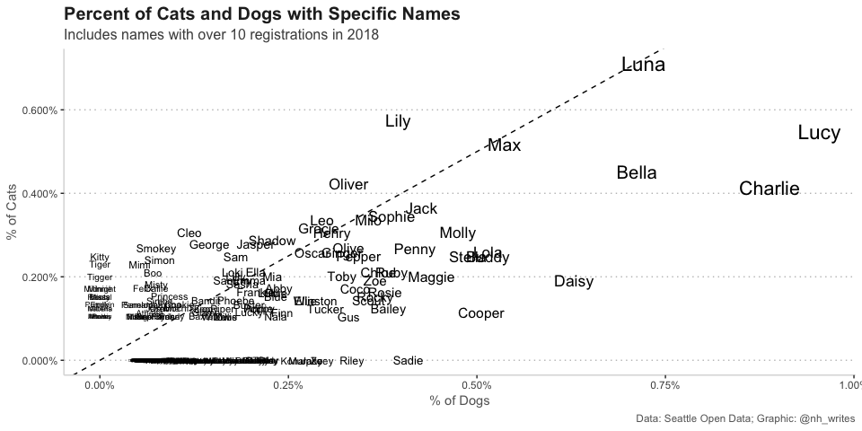
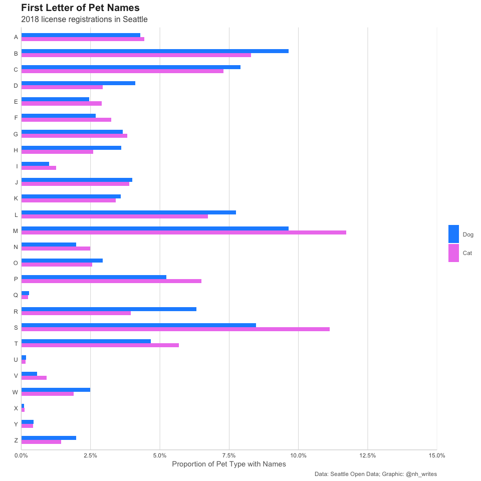

Seattle Pets
================
Nancy Huynh
2019-03-26

-   [Seattle Pet Names](#seattle-pet-names)
    -   [Libraries & Data Import](#libraries-data-import)
        -   [Quick Look at the Data](#quick-look-at-the-data)
        -   [Cat or Dog Names](#cat-or-dog-names)
        -   [First Letter of Pet Names](#first-letter-of-pet-names)
    -   [After Thoughts](#after-thoughts)

Seattle Pet Names
=================

Quick look at pets registered in the Seattle. The data originates from [Seattle's Open Data](https://data.seattle.gov/Community/Seattle-Pet-Licenses/jguv-t9rb), and was also made available in the \#TidyTuesday [repo](https://github.com/rfordatascience/tidytuesday/tree/master/data/2019/2019-03-26).

Libraries & Data Import
-----------------------

``` r
library(tidyverse)
library(lubridate)
library(skimr)

seattle_pets <- readr::read_csv("https://raw.githubusercontent.com/rfordatascience/tidytuesday/master/data/2019/2019-03-26/seattle_pets.csv")

glimpse(seattle_pets)
```

    ## Observations: 52,519
    ## Variables: 7
    ## $ license_issue_date <chr> "November 16 2018", "November 11 2018", "Nove…
    ## $ license_number     <chr> "8002756", "S124529", "903793", "824666", "S1…
    ## $ animals_name       <chr> "Wall-E", "Andre", "Mac", "Melb", "Gingersnap…
    ## $ species            <chr> "Dog", "Dog", "Dog", "Cat", "Cat", "Dog", "Do…
    ## $ primary_breed      <chr> "Mixed Breed, Medium (up to 44 lbs fully grow…
    ## $ secondary_breed    <chr> "Mix", "Dachshund, Standard Wire Haired", NA,…
    ## $ zip_code           <chr> "98108", "98117", "98136", "98117", "98144", …

``` r
#converting date string to Date type after viewing the glimpse
seattle_pets <- seattle_pets %>%
  mutate(license_issue_date = mdy(license_issue_date))
```

### Quick Look at the Data

There's quite a bit of data available, and it goes pretty far back, but it doesn't look like tracking officially started until about 2014. And it's not just cats and dogs either. Some people have registered their pigs and goats as pets.

``` r
seattle_pets %>%
  arrange(license_issue_date) %>%
  head(12)
```

    ## # A tibble: 12 x 7
    ##    license_issue_d… license_number animals_name species primary_breed
    ##    <date>           <chr>          <chr>        <chr>   <chr>        
    ##  1 2003-04-19       200097         Tinkerdelle  Cat     Domestic Sho…
    ##  2 2004-02-04       S109299        Chivja       Dog     Saint Bernard
    ##  3 2006-02-07       75432          Pepper       Cat     Manx         
    ##  4 2008-03-20       135598         Buddy        Dog     Retriever, L…
    ##  5 2008-12-01       957147         Finigan      Dog     Spaniel, Iri…
    ##  6 2011-03-29       141222         Jenkey       Dog     Australian C…
    ##  7 2012-12-01       893696         Fancy        Dog     Maltese      
    ##  8 2014-01-21       212932         Rosie        Dog     Retriever, L…
    ##  9 2014-01-28       83614          Pepsi        Dog     Australian S…
    ## 10 2014-04-03       280523         Abby         Dog     Retriever, L…
    ## 11 2014-04-07       81166          Olive        Dog     Terrier, Bull
    ## 12 2014-04-09       960482         Daisy        Dog     Retriever, L…
    ## # … with 2 more variables: secondary_breed <chr>, zip_code <chr>

``` r
skim(seattle_pets)
```

    ## Skim summary statistics
    ##  n obs: 52519 
    ##  n variables: 7 
    ## 
    ## ── Variable type:character ──────────────────────────────────────────────────────────────────────────────────────────────────────────────────────────────
    ##         variable missing complete     n min max empty n_unique
    ##     animals_name     483    52036 52519   1  50     0    13929
    ##   license_number       0    52519 52519   1   8     0    52497
    ##    primary_breed       0    52519 52519   3  46     0      336
    ##  secondary_breed   29517    23002 52519   3  46     0      260
    ##          species       0    52519 52519   3   4     0        4
    ##         zip_code     397    52122 52519   4  10     0      167
    ## 
    ## ── Variable type:Date ───────────────────────────────────────────────────────────────────────────────────────────────────────────────────────────────────
    ##            variable missing complete     n        min        max
    ##  license_issue_date       0    52519 52519 2003-04-19 2018-12-31
    ##      median n_unique
    ##  2018-04-04     1064

``` r
seattle_pets %>%
  count(species)
```

    ## # A tibble: 4 x 2
    ##   species     n
    ##   <chr>   <int>
    ## 1 Cat     17294
    ## 2 Dog     35181
    ## 3 Goat       38
    ## 4 Pig         6

### Cat or Dog Names

Curious to know if there's some names that are more "dog" and some that are more "cat". Interestingly Luna is equally popular with cats and dogs. I would have guessed its a more "cat" name 'cause of [Sailor Moon's cat](https://yattatachi.com/top-6-iconic-and-adorable-pets-in-anime-history). Also no surprise that there are some names that people only give to cats, i.e. Kitty. Although someone ought to break the mould with that one...

``` r
seattle_pets %>% 
  filter(species %in% c("Cat", "Dog"),
         license_issue_date > "2017-12-31",
         !is.na(animals_name)) %>%
  group_by(animals_name, species) %>%
  summarise(n = n()) %>%
  group_by(species) %>%
  mutate(prop = n / sum(n)) %>%
  filter(n > 10) %>%
  select(animals_name, species, prop) %>%
  spread(key = species, value = prop, fill = 0) %>%
  ggplot(aes(x = Dog, y = Cat)) +
  geom_text(aes(label = animals_name, size = Cat + Dog), show.legend = FALSE) +
  scale_y_continuous(labels = scales::percent) +
  scale_x_continuous(labels = scales::percent) +
  nh_theme +
  labs(x = "% of Dogs",
       y = "% of Cats",
       title = "Percent of Cats and Dogs with Specific Names",
       subtitle = "Includes names with over 10 registrations in 2018",
       caption = "Data: Seattle Open Data; Graphic: @nh_writes") +
  geom_abline(slope = 1, intercept = 0, linetype = 2)
```

 *Pretty messy chart here!*

### First Letter of Pet Names

Roughly from the chart above we can see that names that start with "L" are quite popular. Here's a closer look. "M" tops the list for both cats and dogs. "L" is definitely in the top 5. The top five letters are the same for both cats in dogs, just in slightly different order.

``` r
seattle_pets %>%
  mutate(first_letter = str_to_upper(substr(animals_name, 1, 1))) %>%
  group_by(first_letter, species) %>%
  filter(first_letter %in% LETTERS,
         species %in% c("Cat", "Dog"),
         license_issue_date > "2017-12-31") %>%
  summarize(n = n()) %>%
  group_by(species) %>%
  mutate(prop = (n / sum(n))*100, rank = rank(-prop)) %>%
  filter(rank <= 5) %>%
  ungroup() %>%
  arrange(species, desc(prop)) %>%
  transmute(`Pet Type` = species,
            `Rank` = rank,
            `Name Starts With` = first_letter,
            `% With Name` = prop) %>%
  head(10) %>% knitr::kable()
```

| Pet Type |  Rank| Name Starts With |  % With Name|
|:---------|-----:|:-----------------|------------:|
| Cat      |     1| M                |    11.729107|
| Cat      |     2| S                |    11.123919|
| Cat      |     3| B                |     8.280499|
| Cat      |     4| C                |     7.291066|
| Cat      |     5| L                |     6.733910|
| Dog      |     1| M                |     9.649470|
| Dog      |     2| B                |     9.636276|
| Dog      |     3| S                |     8.470774|
| Dog      |     4| C                |     7.903417|
| Dog      |     5| L                |     7.745085|

Here's a chart with all the letters of the alphabet.

``` r
seattle_pets %>%
  mutate(first_letter = str_to_upper(substr(animals_name, 1, 1))) %>%
  group_by(first_letter, species) %>%
  filter(first_letter %in% LETTERS,
         species %in% c("Cat", "Dog"),
         license_issue_date > "2017-12-31") %>%
  summarize(n = n()) %>%
  group_by(species) %>%
  mutate(prop = n / sum(n)) %>%
  ggplot(aes(x = fct_rev(first_letter), y = prop, fill = factor(species))) +
  geom_col(position = "dodge", width = 0.5) + 
  scale_x_discrete(name = "") +
  scale_y_continuous(labels = scales::percent, name = "Proportion of Pet Type with Names", expand = c(0,0), limits = c(0, 0.15), breaks = seq(from = 0, to = 0.15, by = 0.025)) +
  scale_fill_manual(name = "", breaks = c("Dog", "Cat"), values = c("Cat" = "violet","Dog" = "dodgerBlue")) +
  coord_flip() +
  nh_theme +
  theme(panel.grid.major.x = element_line(colour = "grey80", linetype = 1, size = 0.25),
        panel.grid.major.y = element_blank(),
        axis.ticks = element_blank(),
        legend.position = "right") +
  labs(title = "First Letter of Pet Names",
       subtitle = "2018 license registrations in Seattle",
       caption = "Data: Seattle Open Data; Graphic: @nh_writes")
```



After Thoughts
--------------

Learned a few more R tricks with this one, including how to make a quick `kable()` table using `transmute()` to clean up the column names. Also tried out `substr()` for the first time. I wonder how good a decision tree or random forest model would be using letter of first name and length of name and year of registration would be at predicting the type of animal (cat vs dog)... it would be a pretty silly model to build anyway, lol.
