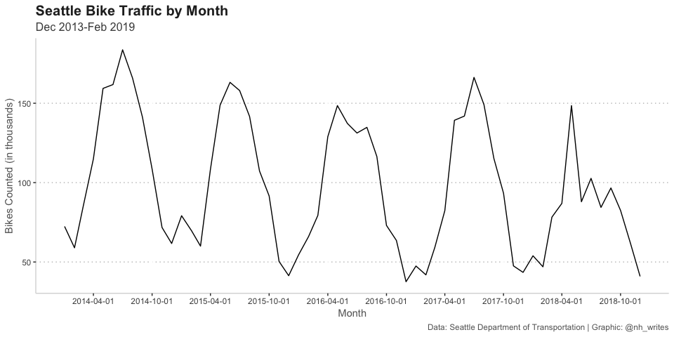
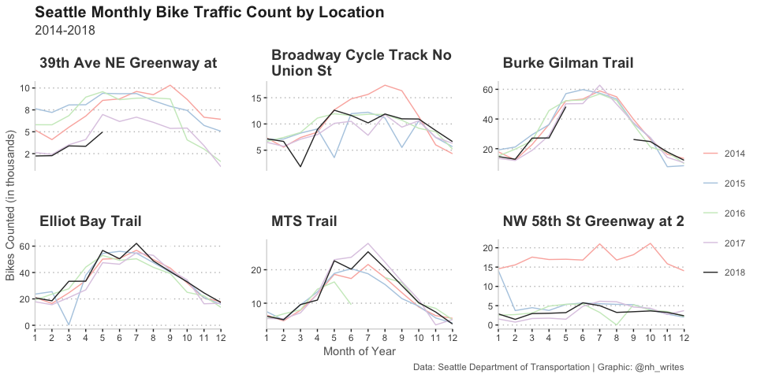

Seattle Bike Counters
================
Nancy Huynh
2019-04-03

-   [Data Import and Libraries](#data-import-and-libraries)
-   [Quick Skim of the Data](#quick-skim-of-the-data)
-   [How has bike traffic changed over time?](#how-has-bike-traffic-changed-over-time)
-   [How has bike traffic changed over time for each of the bike traffic counters?](#how-has-bike-traffic-changed-over-time-for-each-of-the-bike-traffic-counters)

Data Import and Libraries
-------------------------

Another [TidyTuesday](https://github.com/rfordatascience/tidytuesday) exploratory analysis. This week the data is on bike traffic in Seattle at seven locations. The data is from the Seattle Department of Transportation, and you can get it from the [TidyTuesday Repo](https://github.com/rfordatascience/tidytuesday/tree/master/data/2019/2019-04-02)

``` r
library(tidyverse)
library(lubridate)
library(skimr)

bike_traffic <- readr::read_csv("https://raw.githubusercontent.com/rfordatascience/tidytuesday/master/data/2019/2019-04-02/bike_traffic.csv", 
                                col_types = "cccdd") %>%
                mutate(date = mdy_hms(date),
                       direction = factor(direction))
```

Quick Skim of the Data
----------------------

Something is a bit amiss with a few of the bike counts 8191 and 4095 counts occurring in the early hours of the morning between 3AM-6AM on May 30, 2018. Not sure what would cause this based on some quick Googling--it is possible there was some error with the counter during those hours. Will have to keep this in mind.

``` r
skim(bike_traffic)
```

    ## Skim summary statistics
    ##  n obs: 515688 
    ##  n variables: 5 
    ## 
    ## ── Variable type:character ──────────────────────────────────────────────────────────────────────────────────────────────────────────────────────────────────────────
    ##  variable missing complete      n min max empty n_unique
    ##  crossing       0   515688 515688   9  40     0        7
    ## 
    ## ── Variable type:factor ─────────────────────────────────────────────────────────────────────────────────────────────────────────────────────────────────────────────
    ##   variable missing complete      n n_unique
    ##  direction       0   515688 515688        4
    ##                                        top_counts ordered
    ##  Nor: 190488, Sou: 190488, Eas: 90144, Wes: 44568   FALSE
    ## 
    ## ── Variable type:numeric ────────────────────────────────────────────────────────────────────────────────────────────────────────────────────────────────────────────
    ##    variable missing complete      n  mean     sd p0 p25 p50 p75 p100
    ##  bike_count    6603   509085 515688 11.78  28.75  0   0   3  12 8191
    ##   ped_count  261713   253975 515688 26.04 100.55  0   0   3  19 4946
    ##      hist
    ##  ▇▁▁▁▁▁▁▁
    ##  ▇▁▁▁▁▁▁▁
    ## 
    ## ── Variable type:POSIXct ────────────────────────────────────────────────────────────────────────────────────────────────────────────────────────────────────────────
    ##  variable missing complete      n        min        max     median
    ##      date       0   515688 515688 2013-12-18 2019-02-28 2016-04-28
    ##  n_unique
    ##     45576

``` r
bike_traffic %>%
  arrange(desc(bike_count)) %>%
  head(10)
```

    ## # A tibble: 10 x 5
    ##    date                crossing           direction bike_count ped_count
    ##    <dttm>              <chr>              <fct>          <dbl>     <dbl>
    ##  1 2018-05-30 06:00:00 Burke Gilman Trail South           8191         0
    ##  2 2018-05-30 04:00:00 Burke Gilman Trail South           8191       255
    ##  3 2018-05-30 03:00:00 Burke Gilman Trail South           4095      4095
    ##  4 2015-08-15 06:00:00 Burke Gilman Trail North            794         7
    ##  5 2017-08-18 06:00:00 Burke Gilman Trail North            757        11
    ##  6 2017-08-18 07:00:00 Burke Gilman Trail North            752        19
    ##  7 2015-08-14 06:00:00 Burke Gilman Trail North            750        11
    ##  8 2015-05-16 10:00:00 Burke Gilman Trail South            718         0
    ##  9 2016-08-12 06:00:00 Burke Gilman Trail North            705        18
    ## 10 2016-08-13 06:00:00 Burke Gilman Trail North            590         7

``` r
remove <- which(bike_traffic$bike_count > 4000)

bike_traffic <- bike_traffic[-remove, ] #remove the three really high values
```

How has bike traffic changed over time?
---------------------------------------

You can definitely see the seasonality peaks between summer and winter. Looks like the seasonal peaks have been decreasing year to year, and the high season in 2018 doesn't seem to last nearly as long, which is odd. Digging further into this in the next chart. Note: I took out the Sealth Trail as there's only two years of data available.

``` r
bike_traffic %>%
  filter(date >= "2014-01-01", date <= "2018-12-31",  #filter out these years: only 1 month in 2013, and just 2 months in 2019 so far
         crossing != "Sealth Trail") %>%              #also filtering out Sealth Trail
  mutate(month = as.Date(floor_date(date, "month"))) %>% 
  group_by(month) %>%
  summarise(total_bike_count  = sum(bike_count, na.rm = TRUE)) %>%
  ggplot(aes(x = month, y = total_bike_count / 1000)) +
  geom_line() +
  scale_x_date(name = "Month", date_breaks = "6 months") + 
  labs(y = "Bikes Counted (in thousands)",
       title = "Seattle Bike Traffic by Month",
       subtitle = "Dec 2013-Feb 2019",
       caption = "Data: Seattle Department of Transportation | Graphic: @nh_writes") +
  nh_theme
```



How has bike traffic changed over time for each of the bike traffic counters?
-----------------------------------------------------------------------------

I started out plotting the data and noticed some months where the count drops to zero, and also some months where there was no data at all. By using tidy::complete I was able to fill in the missing months with NAs. I also converted months that had a 0 count to NA as well. This allows the chart to show broken lines. Even then, we can visually see when the counters weren't recording properly, i.e. March 2015 on the Elliot Bay Trail where it dips close to 0. In 2018 the counters for two of the trails did not record counts during the summer months -- Burke Gilman Trail, and 39th Ave. The 39th Ave one did not have any counts after May. Given these two findings, the 2018 high season was missing a good chunk of data, especially since the Burke Gilman Trail counter historically has some of the highest counts. Also odd that the NW 58th St Greenway counter showed really high counts in 2014 and for the other years it is about 1/3 of the 2014 counts. Given these observations of missing count information, it's a bit hard to say that ridership was down in 2018 overall. Although we can see that some locations are getting lower bike traffic based on the available months, i.e. Burke Gilman Trail and 39th Ave. Elliot Bay location had some of the highest traffic in 2018 during the peak season.

``` r
bike_traffic_my <- bike_traffic %>%
  mutate(month = month(date),
         year = year(date)) %>%
  filter((!year %in% c(2013, 2019)),
         crossing != "Sealth Trail") %>%
  group_by(crossing, year, month) %>%
  summarize(total_bike_count = sum(bike_count, na.rm = TRUE)) %>%
  ungroup()

bike_traffic_my <- complete(bike_traffic_my, crossing, year, month) %>%
  mutate(total_bike_count = ifelse(total_bike_count == 0, NA, total_bike_count))

nh_colors <- RColorBrewer::brewer.pal(4, "Pastel1")
nh_colors[5] <- "Grey20"

ggplot(bike_traffic_my, aes(x = month, y = total_bike_count / 1000, color = as.factor(year))) +
  geom_line() +
  facet_wrap(~crossing, scales = "free_y", labeller = labeller(crossing = label_wrap_gen(30))) +
  scale_color_manual(values = nh_colors, name = "") +
  scale_x_continuous(name = "Month of Year", breaks = seq(from = 1, to = 12, by = 1), expand = c(0,0)) +
  scale_y_continuous(name = "Bikes Counted (in thousands)", labels = scales::number_format(accuracy = 1)) +
  nh_theme +
  labs(title = "Seattle Monthly Bike Traffic Count by Location",
       subtitle = "2014-2018",
       caption = "Data: Seattle Department of Transportation | Graphic: @nh_writes")
```



``` r
file_path <- file.path("~", "Data For R", "seattle_bike_traffic_location.png")
ggsave(file_path, width = 29, height = 21, units = "cm", dpi = "retina")
```
