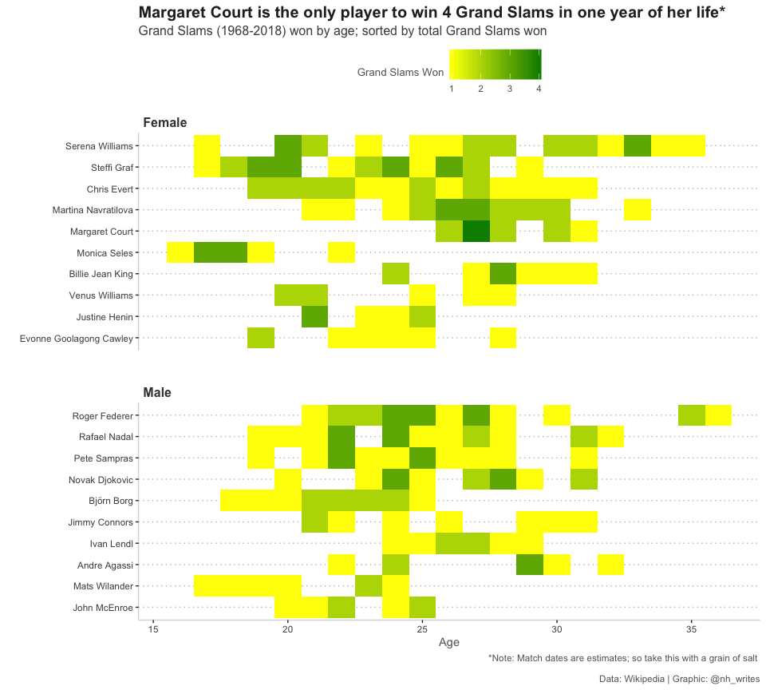

Tennis
================
Nancy Huynh
2019-04-11

-   [Tennis Grand Slams](#tennis-grand-slams)
    -   [Libraries and Data Import](#libraries-and-data-import)
    -   [How many Grand Slams did players win at each age of their life?](#how-many-grand-slams-did-players-win-at-each-age-of-their-life)

Tennis Grand Slams
==================

This week's TidyTuesday dataset looks at Grand Slam Tournaments since 1968. I used to follow tennis more closely but haven't kept up with the players and the games in recent years. This should be fun! Dataset can be found in the [TidyTuesday repo](https://github.com/rfordatascience/tidytuesday/tree/master/data/2019/2019-04-09).

Libraries and Data Import
-------------------------

``` r
library(tidyverse)
```

I filtered out 2019 since the season has just started.

``` r
grand_slams <- readr::read_csv("https://raw.githubusercontent.com/rfordatascience/tidytuesday/master/data/2019/2019-04-09/grand_slams.csv") %>%
  filter(year < 2019)

player_dob <- readr::read_csv("https://raw.githubusercontent.com/rfordatascience/tidytuesday/master/data/2019/2019-04-09/player_dob.csv")
```

How many Grand Slams did players win at each age of their life?
---------------------------------------------------------------

Calculate the number of grand slams won at each player's age. Note that date of the Grand Slam matches are estimates.

``` r
age_slams_comb <- left_join(grand_slams, player_dob, by = c("name")) %>% 
  mutate(age = floor(as.numeric(tournament_date - date_of_birth)/365.2425)) %>%
  group_by(name, age, gender) %>% 
  summarize(counts = n()) %>% 
  group_by(name) %>% 
  mutate(total_wins = cumsum(counts)) %>% 
  arrange(desc(total_wins))
```

Pull out the top 10 players based on total life-time Grand Slam wins for each gender.

``` r
top_players <- age_slams_comb %>%
  group_by(name, gender) %>%
  summarise(max_total_wins = max(total_wins)) %>%
  ungroup() %>%
  group_by(gender) %>%
  top_n(10, max_total_wins) %>%
  ungroup()%>%
  select(name) %>% 
  pull()

plot_top_players <- age_slams_comb %>%
  filter(name %in% top_players)
```

Plot the number of Grand Slam wins at each age for the top players. Margaret Court is the only player to win 4 Grand Slams in one year of her life (at age 27). Although this should be taken with a grain of salt since the match dates are estimates in this data set. Meanwhile, Serena Williams and Roger Federer are still rocking it well into their late 30s.

``` r
ggplot(plot_top_players, aes(x = fct_reorder(name, counts, sum), y = age, fill = counts)) +
  geom_tile() +
  coord_flip() +
  facet_wrap(~gender, nrow = 2, scales = "free_y") +
  scale_fill_continuous(low = "yellow", high = "green4", name = "Grand Slams Won") +
  nh_theme +
  theme(panel.grid.major.x = element_blank(),
        legend.position = "top", legend.direction = "horizontal") +
  labs(x = "",
       y = "Age",
       title = "Margaret Court is the only player to win 4 Grand Slams in one year of her life*",
       subtitle = "Grand Slams (1968-2018) won by age; sorted by total Grand Slams won",
       caption = "*Note: Match dates are estimates; so take this with a grain of salt \n 
       Data: Wikipedia | Graphic: @nh_writes")
```



``` r
#ggsave("tennis_grand_slams.png", device = "png", units = "cm", width = 29, height = 21, dpi = "retina")
```
