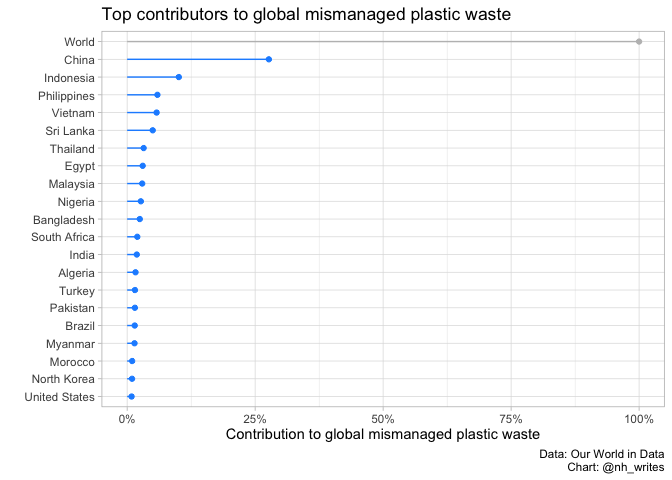

Plastic Waste
================
Nancy Huynh
2019-06-19

-   [Global Plastic Waste](#global-plastic-waste)
    -   [Data import and libraries](#data-import-and-libraries)
    -   [How do countries contribute to the global plastic pollution?](#how-do-countries-contribute-to-the-global-plastic-pollution)

Global Plastic Waste
====================

Just a quick one to practice a bit of data cleaning using the `janitor` package.

Data import and libraries
-------------------------

The data requires a little bit of cleaning and filtering as there are a considerable amount of NAs present.

``` r
library(tidyverse)
library(janitor)
library(scales)

coast_vs_waste <- readr::read_csv("https://raw.githubusercontent.com/rfordatascience/tidytuesday/master/data/2019/2019-05-21/coastal-population-vs-mismanaged-plastic.csv")

waste_vs_gdp <- readr::read_csv("https://raw.githubusercontent.com/rfordatascience/tidytuesday/master/data/2019/2019-05-21/per-capita-plastic-waste-vs-gdp-per-capita.csv")

clean_waste_data <- function(waste_data){
  waste_data %>%
    clean_names() %>%
    rename(country = entity,
           country_code = code,
           total_population = total_population_gapminder) %>%
    filter(year == 2010) %>%
    select(-year)
}

waste_gdp_clean <- waste_vs_gdp %>% 
  clean_waste_data() %>%
  select(-total_population) %>%
  left_join(coast_vs_waste %>% clean_waste_data(), by = c("country", "country_code")) %>%
  rename(gdp_capita = gdp_per_capita_ppp_constant_2011_international_constant_2011_international,
         plastic_waste_capita_kg_per_day = per_capita_plastic_waste_kilograms_per_person_per_day)
```

How do countries contribute to the global plastic pollution?
------------------------------------------------------------

No surprise here that China is a huge contributor. Seeing some of the other top countries there might be a relationship between infrastructure development, corruption, and mismanaged waste.

``` r
world_mismanaged_plastic_waste <- waste_gdp_clean %>%
  filter(country == "World") %>%
  pull(mismanaged_plastic_waste_tonnes)

top_countries <- waste_gdp_clean %>%
  filter(!is.na(mismanaged_plastic_waste_tonnes)) %>%
  mutate(percent_of_world_waste = mismanaged_plastic_waste_tonnes / world_mismanaged_plastic_waste) %>%
  top_n(21, mismanaged_plastic_waste_tonnes) 

top_countries %>%
  mutate(country = fct_reorder(country, mismanaged_plastic_waste_tonnes))%>%
  ggplot(aes(x = country, y = percent_of_world_waste)) +
  geom_segment(aes(x = country, xend = country, y = 0, yend = percent_of_world_waste), color = ifelse(top_countries$country == "World", "grey", "dodgerblue")) +
  geom_point(color = ifelse(top_countries$country == "World", "grey", "dodgerblue")) +
  scale_y_continuous(name = "Contribution to global mismanaged plastic waste", labels = percent_format(accuracy = 1)) + 
  labs(x = "",
       title = "Top contributors to global mismanaged plastic waste",
       caption = "Data: Our World in Data\nChart: @nh_writes") +
  coord_flip() +
  theme_light()
```


