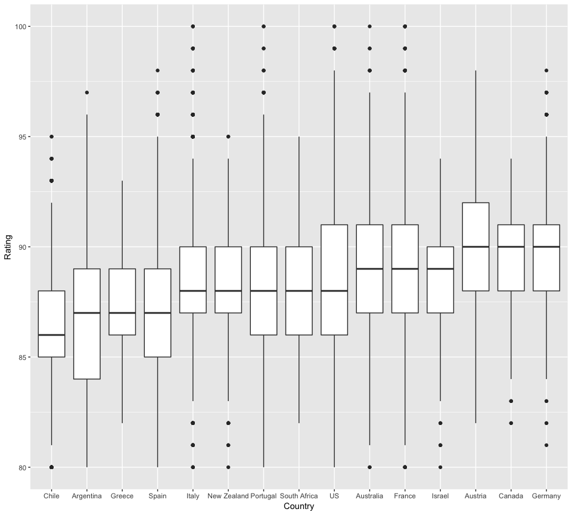
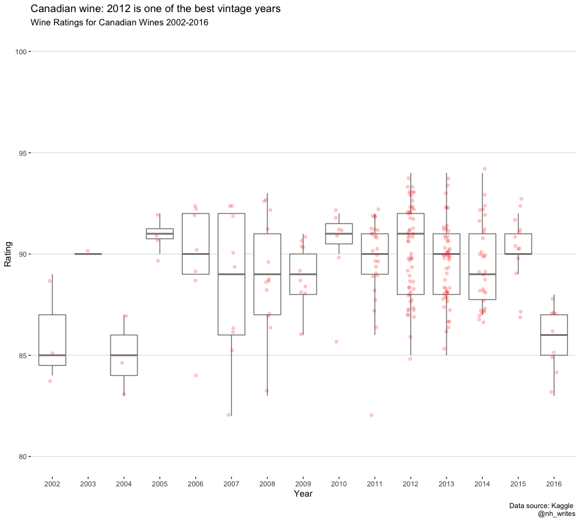

Wine Ratings
================
Nancy Huynh
2019-05-30

-   [Wine Ratings from WineEnthusiast](#wine-ratings-from-wineenthusiast)
    -   [Libraries and Data Import](#libraries-and-data-import)
    -   [How do ratings differ by country of origin?](#how-do-ratings-differ-by-country-of-origin)
    -   [How do Canadian rate over the vintage years?](#how-do-canadian-rate-over-the-vintage-years)
    -   [Where are the 2012 Canadian vintages from?](#where-are-the-2012-canadian-vintages-from)

Wine Ratings from WineEnthusiast
================================

After a few weeks of hiatus from [\#TidyTuesday](https://twitter.com/search?f=tweets&vertical=default&q=%23tidytuesday&src=tyah) I'm back with to take a quick look at wine ratings. Data originally scraped from [WineEnthusiast](https://www.winemag.com/?s=&drink_type=wine) and made available on [Kaggle](https://www.kaggle.com/zynicide/wine-reviews). I got the dataset from the [TidyTuesday repo](https://github.com/rfordatascience/tidytuesday/tree/master/data/2019/2019-05-28).

Libraries and Data Import
-------------------------

``` r
library(tidyverse)
```

This week I tried out the `stringr::str_extract` function from the `tidyverse` package to extract the vintage year from the title variable.

``` r
wine_ratings <- readr::read_csv("https://raw.githubusercontent.com/rfordatascience/tidytuesday/master/data/2019/2019-05-28/winemag-data-130k-v2.csv")
```

    ## Warning: Missing column names filled in: 'X1' [1]

    ## Parsed with column specification:
    ## cols(
    ##   X1 = col_double(),
    ##   country = col_character(),
    ##   description = col_character(),
    ##   designation = col_character(),
    ##   points = col_double(),
    ##   price = col_double(),
    ##   province = col_character(),
    ##   region_1 = col_character(),
    ##   region_2 = col_character(),
    ##   taster_name = col_character(),
    ##   taster_twitter_handle = col_character(),
    ##   title = col_character(),
    ##   variety = col_character(),
    ##   winery = col_character()
    ## )

``` r
wine_ratings <- wine_ratings %>%
  select(-X1) %>%
  mutate(year = as.integer(str_extract(title, "(19|20)[:digit:][:digit:]")))
```

``` r
summary(wine_ratings)
```

    ##    country          description        designation            points      
    ##  Length:129971      Length:129971      Length:129971      Min.   : 80.00  
    ##  Class :character   Class :character   Class :character   1st Qu.: 86.00  
    ##  Mode  :character   Mode  :character   Mode  :character   Median : 88.00  
    ##                                                           Mean   : 88.45  
    ##                                                           3rd Qu.: 91.00  
    ##                                                           Max.   :100.00  
    ##                                                                           
    ##      price           province           region_1        
    ##  Min.   :   4.00   Length:129971      Length:129971     
    ##  1st Qu.:  17.00   Class :character   Class :character  
    ##  Median :  25.00   Mode  :character   Mode  :character  
    ##  Mean   :  35.36                                        
    ##  3rd Qu.:  42.00                                        
    ##  Max.   :3300.00                                        
    ##  NA's   :8996                                           
    ##    region_2         taster_name        taster_twitter_handle
    ##  Length:129971      Length:129971      Length:129971        
    ##  Class :character   Class :character   Class :character     
    ##  Mode  :character   Mode  :character   Mode  :character     
    ##                                                             
    ##                                                             
    ##                                                             
    ##                                                             
    ##     title             variety             winery               year     
    ##  Length:129971      Length:129971      Length:129971      Min.   :1904  
    ##  Class :character   Class :character   Class :character   1st Qu.:2009  
    ##  Mode  :character   Mode  :character   Mode  :character   Median :2011  
    ##                                                           Mean   :2011  
    ##                                                           3rd Qu.:2013  
    ##                                                           Max.   :2017  
    ##                                                           NA's   :4626

How do ratings differ by country of origin?
-------------------------------------------

I filtered out countries that did not have a lot of representation, including only countries that had 200 or more wines rated. Canadian wines have one of the highest median ratings, but there are no exceptional outliers on the higher-end like Italy, Portugal, US, Australia, and France.

``` r
wine_countries <- wine_ratings %>%
  group_by(country) %>%
  summarise(num_wines = n()) %>%
  arrange(desc(num_wines)) %>%
  filter(num_wines >= 200) %>%
  pull(country)
  
wine_ratings %>% 
  filter(country %in% wine_countries) %>%
  ggplot(aes(x = fct_reorder(country, points), y = points)) +
  geom_boxplot() +
  labs(x = "Country",
       y = "Rating")
```



How do Canadian rate over the vintage years?
--------------------------------------------

In the most recent decade, 2012 looks like one of the best years for Canadian wine. Meanwhile 2014 and 2016 vintages are not rated as well.

``` r
wine_ratings %>%
  filter(!is.na(year),
         year >= 2000,
         country == "Canada") %>%
  ggplot(aes(x = as.factor(year), y = points)) +
  geom_boxplot(color = "grey50", outlier.alpha = 0) + 
  geom_jitter(position = position_jitter(width = 0.1), color = "red", alpha = 0.2) +
  scale_y_continuous(name = "Rating", limits = c(80, 100), labels = seq(80, 100, 5)) +
  scale_x_discrete(name = "Year") + 
  theme(panel.background = element_rect(fill = "white"),
        panel.grid.major.y = element_line(colour = "grey90"),
        panel.grid.major.x = element_blank()) +
  labs(title = "Canadian wine: 2012 is one of the best vintage years",
       subtitle = "Wine Ratings for Canadian Wines 2002-2016",
       caption = "Data source: Kaggle \n @nh_writes")
```



Where are the 2012 Canadian vintages from?
------------------------------------------

Looks like the majority of the wines rated are from the Okanagan Valley in British Columbia. Doing a quick Google search does indicate that 2012 is a pretty good vintage year.

``` r
wine_ratings %>%
  filter(year == 2012,
         country == "Canada") %>%
  group_by(province, region_1) %>%
  summarize(num_wines = n(), median_points = median(points))
```

    ## # A tibble: 6 x 4
    ## # Groups:   province [2]
    ##   province         region_1            num_wines median_points
    ##   <chr>            <chr>                   <int>         <dbl>
    ## 1 British Columbia Okanagan Valley            42          90  
    ## 2 British Columbia Similkameen Valley          4          92.5
    ## 3 Ontario          Beamsville Bench            2          92  
    ## 4 Ontario          Niagara Peninsula           5          91  
    ## 5 Ontario          Niagara-On-The-Lake         2          89  
    ## 6 Ontario          Short Hills Bench           2          88
