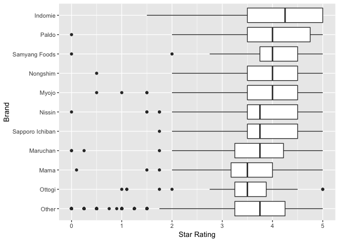
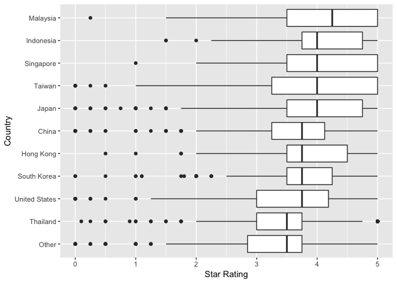
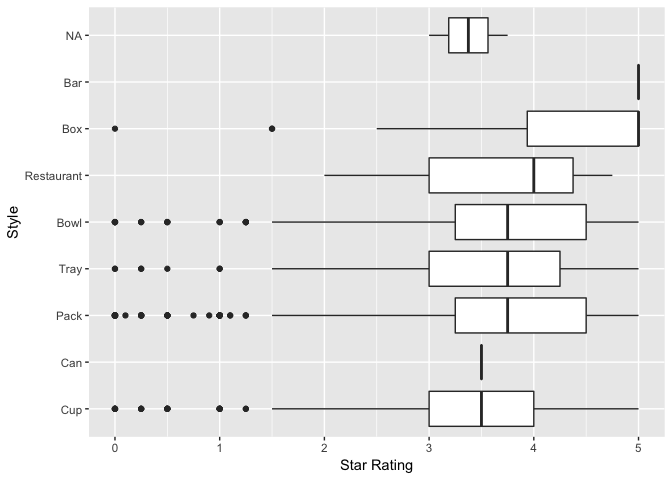
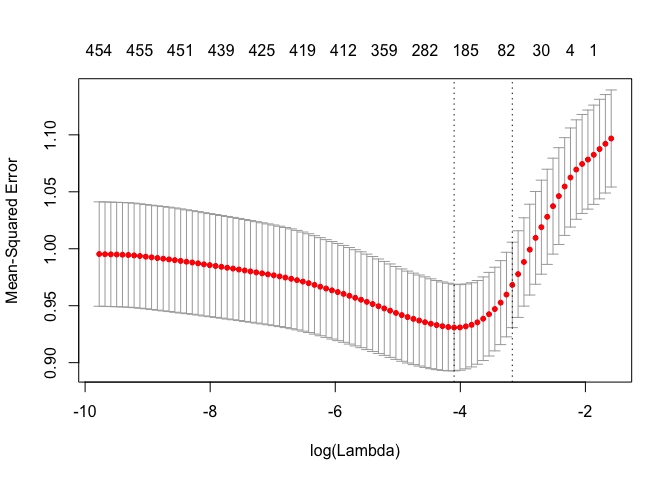
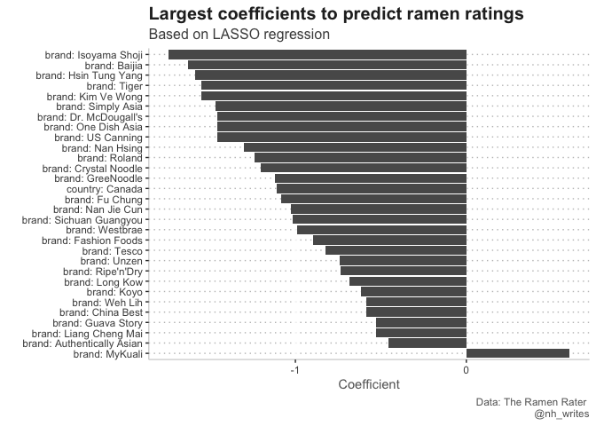

Ramen Ratings
================
Nancy Huynh
2019-06-04

-   [Ramen Ratings from The Ramen Rater](#ramen-ratings-from-the-ramen-rater)
    -   [Data Import and Libraries](#data-import-and-libraries)
    -   [What are the ratings across brand, style, and country of origin?](#what-are-the-ratings-across-brand-style-and-country-of-origin)
    -   [What factors influences the star rating of the ramen?](#what-factors-influences-the-star-rating-of-the-ramen)
    -   [Things to do later](#things-to-do-later)
    -   [References](#references)

Ramen Ratings from The Ramen Rater
==================================

This week I take a stab at LASSO regression using the week 23 [\#TidyTuesday](https://github.com/rfordatascience/tidytuesday/tree/master/data/2019/2019-06-04) data. The original data comes from [The Ramen Rater](https://www.theramenrater.com/resources-2/the-list/), which is indeed ratings for ramen (the "instant noodle" type). I first saw LASSO regression from [Dave Robinson's YouTube screencast](https://www.youtube.com/watch?v=qirKGdQvy9U) of his analysis on a TidyTuesday dataset earlier this year. Other resources I used are below.

Data Import and Libraries
-------------------------

``` r
library(tidyverse)
library(glmnet)
library(broom)

ramen_ratings <- readr::read_csv("https://raw.githubusercontent.com/rfordatascience/tidytuesday/master/data/2019/2019-06-04/ramen_ratings.csv", col_types = "ifcffd")

summary(ramen_ratings)
```

    ##  review_number              brand        variety              style     
    ##  Min.   :   1.0   Nissin       : 443   Length:3180        Pack   :1832  
    ##  1st Qu.: 795.5   Nongshim     : 110   Class :character   Bowl   : 612  
    ##  Median :1590.0   Maruchan     : 106   Mode  :character   Cup    : 559  
    ##  Mean   :1590.1   Myojo        :  90                      Tray   : 138  
    ##  3rd Qu.:2384.5   Samyang Foods:  82                      Box    :  32  
    ##  Max.   :3180.0   Paldo        :  71                      (Other):   5  
    ##  NA's   :1        (Other)      :2278                      NA's   :   2  
    ##           country         stars      
    ##  Japan        : 532   Min.   :0.000  
    ##  United States: 382   1st Qu.:3.250  
    ##  South Korea  : 357   Median :3.750  
    ##  Taiwan       : 330   Mean   :3.688  
    ##  China        : 207   3rd Qu.:4.500  
    ##  Thailand     : 205   Max.   :5.000  
    ##  (Other)      :1167   NA's   :14

What are the ratings across brand, style, and country of origin?
----------------------------------------------------------------

Since there are numerous countries and brands I use `fct_lump` to grab the top 10 and lump the remaining into other.

``` r
ramen_boxplots <- function(ramen_df, ramen_col) {
  ramen_col <- enquo(ramen_col)
  
  ramen_df %>%
    ggplot(aes(x = fct_relevel(fct_reorder(fct_lump(!!ramen_col, n = 10), stars, na.rm = TRUE), "Other", after = 0), y = stars)) +
    geom_boxplot(na.rm = TRUE) + 
    coord_flip() +
    labs(y = "Star Rating",
         x = str_to_title(rlang::as_label(ramen_col)))
}

ramen_boxplots(ramen_ratings, brand)
```



``` r
ramen_boxplots(ramen_ratings, country)
```



``` r
ramen_boxplots(ramen_ratings, style)
```

    ## Warning: Unknown levels in `f`: Other

    ## Warning: Unknown levels in `f`: Other



What factors influences the star rating of the ramen?
-----------------------------------------------------

Going to try a lasso regression without engineering any extra features. But, some ideas for engineered features from the `variety` variable could be spicy (i.e. words like "Spicy", "Chili") or noodle type (i.e. words like "udon"", "vermicelli").

``` r
#training data set
ramen_train  <- ramen_ratings %>%
  sample_frac(0.80) %>%
  na.omit()

#testing data set
ramen_test <- ramen_ratings %>%
  anti_join(ramen_train, by = "review_number") %>%
  na.omit()

#create matrix of predictors
features <- model.matrix(stars ~ brand + style + country, ramen_train)[, -1]

#determine which value of lambda to use
cv.lasso <- cv.glmnet(x = features, y = ramen_train$stars, alpha = 1)
plot(cv.lasso)
```



``` r
cv.lasso$lambda.min
```

    ## [1] 0.01407287

``` r
cv.lasso$lambda.1se
```

    ## [1] 0.03251016

``` r
#choosing lambda.1se as this seems to be the typical choice so as to not overfit
ramen_coefs <- cv.lasso$glmnet.fit %>%
  tidy() %>%
  filter(lambda == cv.lasso$lambda.1se) %>%
  arrange(desc(estimate))
```

``` r
ramen_coefs %>%
  filter(term != "(Intercept)") %>%
  top_n(30, abs(estimate)) %>%
  mutate(term = str_replace(term, "brand", "brand: "),
         term = str_replace(term, "country", "country: "),
         term = str_replace(term, "style", "style: ")) %>%
  ggplot(aes(x = fct_reorder(term, -estimate), y = estimate)) +
  geom_col() +
  coord_flip() +
  labs(y = "Coefficient",
       x = "",
       title = "Largest coefficients to predict ramen ratings",
       subtitle = "Based on LASSO regression",
       caption = "Data: The Ramen Rater \n @nh_writes") +
  nh_theme
```



Things to do later
------------------

This is by no means a complete analysis; I'm just trying out LASSO regression using this fairly simple dataset. After looking at the top 30 coefficients I should somehow limit the brands to those that occur more than say 5 times. For example the largest coefficient is brand "Roland", which only occurs 2 times in the whole dataset. I should also see how well the model fairs against the test data set I split out called `ramen_test`.

References
----------

-   [Lasso Regression: Simple Definition](https://www.statisticshowto.datasciencecentral.com/lasso-regression/)
-   [Penalized Logistic Regression Essentials in R: Ridge, Lasso and Elastic Net](http://www.sthda.com/english/articles/36-classification-methods-essentials/149-penalized-logistic-regression-essentials-in-r-ridge-lasso-and-elastic-net/)
