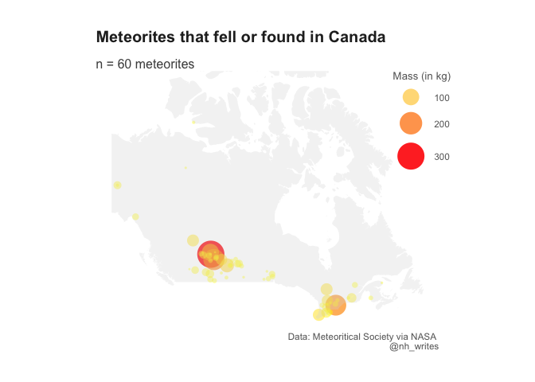

Meteorites
================
Nancy Huynh
2019-06-11

-   [Meterorite Impacts](#meterorite-impacts)
    -   [Data import and libraries](#data-import-and-libraries)
    -   [Add countries to data](#add-countries-to-data)
    -   [Where were meteorites found or fell in Canada? How big were they?](#where-were-meteorites-found-or-fell-in-canada-how-big-were-they)
    -   [Other things to do](#other-things-to-do)
    -   [References](#references)

Meterorite Impacts
==================

I've never made maps using R and this week's data set looks like the perfect opportunity to do just that. I use the week 24 dataset from the [TidyTuesday repo](https://github.com/rfordatascience/tidytuesday/tree/master/data/2019/2019-06-11). The original data comes fromthe Meteoritical Society by way of [NASA](https://data.nasa.gov/Space-Science/Meteorite-Landings/gh4g-9sfh/data). I found a few articles and stackoverlow posts that helped me create this map. All of the links are in the [Reference](#references) section below.

Data import and libraries
-------------------------

``` r
library(tidyverse)
library(maps)
library(sp)
library(rworldmap)

meteorites <- readr::read_csv("https://raw.githubusercontent.com/rfordatascience/tidytuesday/master/data/2019/2019-06-11/meteorites.csv", col_types = "cdffdfdddc")
```

Add countries to data
---------------------

Since the data didn't come with any regional information other than the longitute and latitude I added this information. Using the `sp` and `rworldmap` packages I found the associated country for each meteorite point. The code below comes from this [Stack Overflow post](https://stackoverflow.com/questions/14334970/convert-latitude-and-longitude-coordinates-to-country-name-in-r/14342127#14342127). Roughly what it does is grabs a world map from `rworldmaps`, convert the meteorite points to SpatialPoints objects, then grabs the details of the Polygon object containing each point. To get the country name we pull the ADMIN column.

``` r
meteorite_points <- meteorites %>% 
  select(long, lat) %>%
  # sp::SpatialPoints() will not accept NA so converted NAs to extreme number outside of long-lat limits
  mutate(long = ifelse(is.na(long), -999, long),
         lat = ifelse(is.na(lat), -999, lat))

countriesSP <- getMap(resolution='low')
pointsSP <- SpatialPoints(meteorite_points, proj4string=CRS(proj4string(countriesSP))) 

# use 'over' to get indices of the Polygons object containing each point
indices <- over(pointsSP, countriesSP)
country <- indices$ADMIN

# combine the countries to the original data
meteorites_countries <- meteorites %>%
  cbind(country)
```

Where were meteorites found or fell in Canada? How big were they?
-----------------------------------------------------------------

To get the polygon of Canada I used the `maps` library. And I just learned today to that get a legend that combines size, alpha, and color there are three requirements:

-   the name parameters have to be the same
-   the breaks have to be the same
-   `guides(color = guide_legend())` needs to be added

I followed [this guide](https://www.r-graph-gallery.com/330-bubble-map-with-ggplot2/) from The R Graph Gallery

Since large parts of Canada are quite remote and uninhabited, it is not too surprising that most of the meteorites documented are clustered around areas that are populated, like Southern Ontario and Central-Southern Alberta; there are not many documented in Northern Canada.

``` r
canada <- map_data("world") %>% filter(region=="Canada")
mass_breaks <- c(0, 100, 200, 300)

meteorites_countries %>%
  filter(country == "Canada") %>%
  mutate(mass = mass / 1000) %>% 
  arrange(desc(mass)) %>%
  ggplot(aes(x = long, y = lat)) +
  geom_point(aes(size = mass, color = mass, alpha = mass), stroke = FALSE) + 
  geom_polygon(data = canada, aes(x = long, y = lat, group = group), fill = "grey85", alpha = 0.3) +
  scale_color_continuous(name = "Mass (in kg)", breaks = mass_breaks, high = "red", low = "yellow") +
  scale_size_continuous(name = "Mass (in kg)", breaks = mass_breaks, range = c(1,12)) +
  scale_alpha_continuous(name = "Mass (in kg)", breaks = mass_breaks, range = c(0.4, 0.9)) +
  guides(color = guide_legend()) +
  coord_map(ylim = c(40, 75)) +
  theme_void() +
  labs(title = "Meteorites that fell or found in Canada",
       subtitle = "n = 60 meteorites",
       caption = "Data: Meteoritical Society via NASA \n @nh_writes") +
  nh_theme +
  theme(legend.position = c(0.95, 0.8),
        plot.margin = unit(c(1,1,1,1), "cm"))
```



``` r
#ggsave("meteorites_canada.png", device = "png", units = "cm", width = 29, height = 21, dpi = "retina")
```

Other things to do
------------------

There's lots of other maps that can be made now that I've learned the basics. The `class` column in the data set could also yield an interesting map. With the longitude and latitude data some geo-spatial analysis can also be conducted. Some ideas: determine the ones that fell or were found in urban vs rural areas; the most remote meteorite found; relationship between location and size.

References
----------

-   [Convert latitude and longitude coordinates to country name in R](https://stackoverflow.com/questions/14334970/convert-latitude-and-longitude-coordinates-to-country-name-in-r/14342127#14342127)
-   [BUBBLE MAP WITH GGPLOT2](https://www.r-graph-gallery.com/330-bubble-map-with-ggplot2/)
