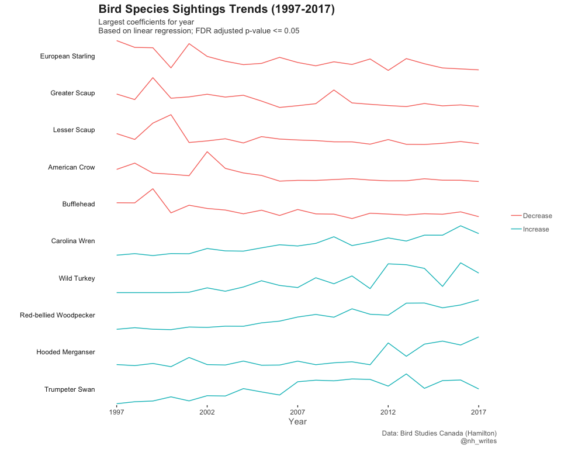
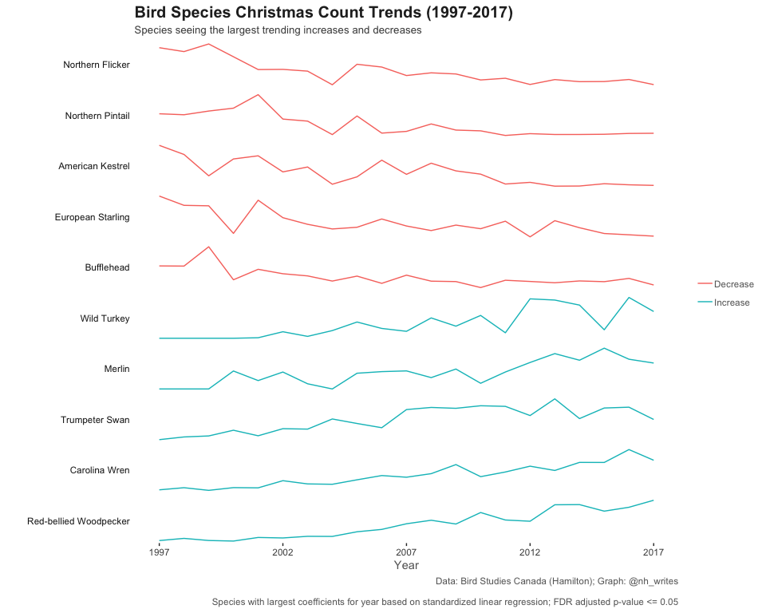

Christmas Bird Counts
================
Nancy Huynh
2019-06-18

-   [Christmas Bird Counts](#christmas-bird-counts)
    -   [Data import and libraries](#data-import-and-libraries)
    -   [Which species sightings are trending up/down in a significant way in the last two decades?](#which-species-sightings-are-trending-updown-in-a-significant-way-in-the-last-two-decades)
    -   [References](#references)

Christmas Bird Counts
=====================

It was exciting to finally see the Christmas Bird Counts data in the [TidyTuesday repo](https://github.com/rfordatascience/tidytuesday/tree/master/data/2019/2019-06-18). I met [Sharleen](https://twitter.com/_sharleen_w), the one who cleaned this data, at an R-Ladies event a few months ago and her excitement for birds was such fun. This week I refreshed my memory on the `nest()` and `unnest()` functions in `dplyr` to determine bird sightings trends by species.

Data import and libraries
-------------------------

``` r
library(tidyverse)
library(broom)

bird_counts <- readr::read_csv("https://raw.githubusercontent.com/rfordatascience/tidytuesday/master/data/2019/2019-06-18/bird_counts.csv")
```

Which species sightings are trending up/down in a significant way in the last two decades?
------------------------------------------------------------------------------------------

Linear regression was run for each species' `how_many_counted_by_hour` to determine the year coefficient. P-values were adjusted using FDR method to account for [multiple comparisons](https://en.wikipedia.org/wiki/Multiple_comparisons_problem). The top 5 largest and smallest coefficients with adjusted p-value &gt;= 0.05 were extracted.

``` r
bird_counts_recent_lm_trend <- bird_counts %>%
  filter(year >= 1997) %>%
  nest(-species, -species_latin) %>%
  mutate(lm = purrr::map(data, ~ lm(how_many_counted_by_hour ~ year, data = .x)),
         tidied = purrr::map(lm, tidy)) %>%
  unnest(tidied) %>%
  filter(term != "(Intercept)",
         !is.na(statistic)) %>%
  mutate(p.adjust = p.adjust(p.value, method = "fdr")) %>%
  filter(p.adjust <= 0.05)
```

Sparklines were created to show the trends of the species.

``` r
##Top 5 smallest and largest coefficients
bird_counts_trends_increase_top <- bird_counts_recent_lm_trend %>% top_n(5, estimate)
bird_counts_trends_increase_bottom <- bird_counts_recent_lm_trend %>% top_n(-5, estimate)

bird_counts_trends_top_bottom <- bind_rows(bird_counts_trends_increase_top, bird_counts_trends_increase_bottom)

bird_counts %>%
  filter(year >= 1997) %>%
  inner_join(bird_counts_trends_top_bottom, by = c("species", "species_latin")) %>%
  mutate(trend = ifelse(estimate > 0, "Increase", "Decrease"),
         species = reorder(species, estimate)) %>%
  ggplot(aes(x = year, y = how_many_counted_by_hour, color = trend)) +
  geom_line() +
  facet_wrap(~ species, ncol = 1, scales = "free_y", strip.position = "left") +
  scale_x_continuous(name = "Year", breaks = seq(1997, 2017, 5)) +
  labs(y = "",
       title = "Bird Species Sightings Trends (1997-2017)",
       subtitle = "Largest coefficients for year \nBased on linear regression; FDR adjusted p-value <= 0.05",
       caption = "Data: Bird Studies Canada (Hamilton)\n@nh_writes") +
  nh_theme +
  theme(strip.text.y = element_text(angle = 180, hjust = 1), #make strip text horizontal
        strip.background = element_rect(fill = "white"),
        axis.text.y = element_blank(),
        axis.ticks.y = element_blank(),
        panel.grid = element_blank(),
        plot.title = element_text(hjust = 0),
        legend.title = element_blank())
```



``` r
#ggsave("bird_trends.png", device = "png", units = "cm", width = 29, height = 21, dpi = "retina")
```

The issue I have with the above analysis is that `how_many_counted_by_hour` isn't scaled; the European Starling has the largest negative coefficient of -5.29 but it is worth noting that it is also one of the most commonly sighted species. This means that as the year increases there are 5.29 fewer sightings of European Starling per hour of observation, but how is this relative to other species like the Northern Flicker which has a coefficient of -0.004 but is not as commonly sighted. The decreasing trend may be very similar, but I can't tell from the coefficient. I try to address this issue below by standardizing `how_many_counted_by_hour` for each species using z-score. There are some differences in top and bottom 5 species compared with the above chart.

``` r
# calculate z-score for standardization
bird_counts_z <- bird_counts %>% 
  filter(year >= 1997) %>%
  group_by(species) %>%
  mutate(z_score = (how_many_counted_by_hour - mean(how_many_counted_by_hour)) / sd(how_many_counted_by_hour)) %>%
  ungroup() %>%
  filter(!is.nan(z_score))

bird_counts_z_lm <- bird_counts_z %>% 
  nest(-species, -species_latin) %>%
   mutate(lm = purrr::map(data, ~ lm(z_score ~ year, data = .x)),
         tidied = purrr::map(lm, tidy)) %>%
  unnest(tidied) %>%
  filter(term != "(Intercept)") %>%
  mutate(p.adjust = p.adjust(p.value, "fdr")) %>%
  filter(p.adjust <= 0.05)

bird_counts_z_increase_top <- bird_counts_z_lm %>% top_n(5, estimate)
bird_counts_z_increase_bottom <- bird_counts_z_lm %>% top_n(-5, estimate)

bird_counts_z_top_bottom <- bind_rows(bird_counts_z_increase_top, bird_counts_z_increase_bottom)

bird_counts %>%
  filter(year >= 1997) %>%
  inner_join(bird_counts_z_top_bottom, by = c("species", "species_latin")) %>%
  mutate(trend = ifelse(estimate > 0, "Increase", "Decrease"),
         species = reorder(species, estimate)) %>%
  ggplot(aes(x = year, y = how_many_counted_by_hour, color = trend)) +
  geom_line() +
  facet_wrap(~ species, ncol = 1, scales = "free_y", strip.position = "left") +
  scale_x_continuous(name = "Year", breaks = seq(1997, 2017, 5)) +
  labs(y = "",
       title = "Bird Species Sightings Trends (1997-2017)",
       subtitle = "Largest coefficients for year \nBased on linear regression of z-score; FDR adjusted p-value <= 0.05",
       caption = "Data: Bird Studies Canada (Hamilton)\n@nh_writes") +
  nh_theme +
  theme(strip.text.y = element_text(angle = 180, hjust = 1), #make strip text horizontal
        strip.background = element_rect(fill = "white"),
        axis.text.y = element_blank(),
        axis.ticks.y = element_blank(),
        panel.grid = element_blank(),
        plot.title = element_text(hjust = 0),
        legend.title = element_blank())
```



References
----------

-   [broom and dplyr](https://cran.r-project.org/web/packages/broom/vignettes/broom_and_dplyr.html)
