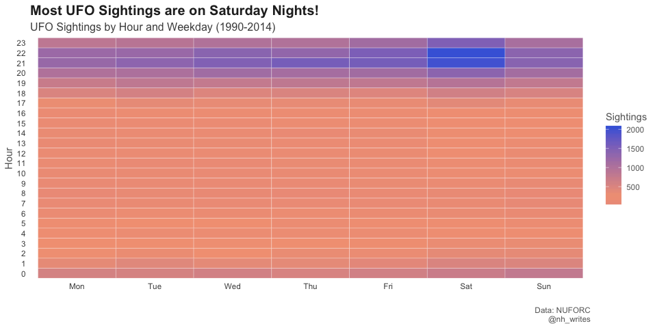
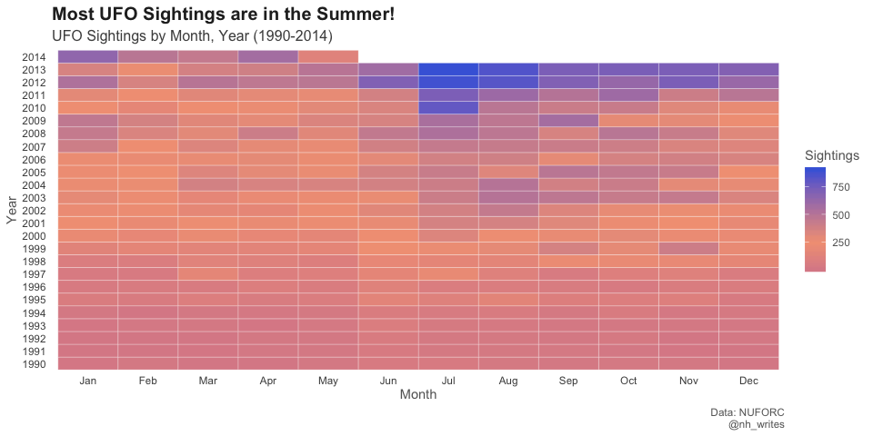
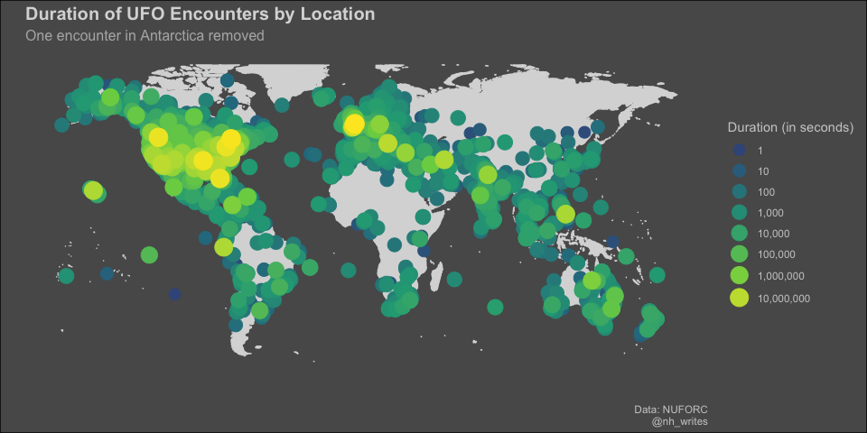
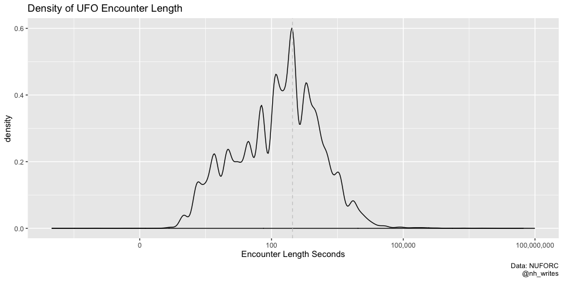

UFO Sightings
================
Nancy Huynh
2019-06-25

-   [UFO Sightings](#ufo-sightings)
    -   [Data import and libraries](#data-import-and-libraries)
    -   [When do most UFO sightings occur? (Day x Hour)](#when-do-most-ufo-sightings-occur-day-x-hour)
    -   [When do most UFO sightings occur? (Month x Year)](#when-do-most-ufo-sightings-occur-month-x-year)
    -   [Is there a relationship between location of encounteres and duration of encounters?](#is-there-a-relationship-between-location-of-encounteres-and-duration-of-encounters)
    -   [Appendix](#appendix)
        -   [Duration of UFO sightings](#duration-of-ufo-sightings)
    -   [Other Analysis](#other-analysis)

UFO Sightings
=============

UFO sightings are not my cup of tea, but I decided to practice some more mapping and to use the `lubridate` package a bit more. I have a few ideas for further analysis if I have more time this week to explore this data.

Data import and libraries
-------------------------

``` r
library(tidyverse)
library(lubridate)
library(scales)

ufo_sightings <- readr::read_csv("https://raw.githubusercontent.com/rfordatascience/tidytuesday/master/data/2019/2019-06-25/ufo_sightings.csv") %>%
  mutate(date_time = mdy_hm(date_time))
```

When do most UFO sightings occur? (Day x Hour)
----------------------------------------------

Not too surprised that most sightings happen on Saturday nights since this is when people have more time just to look at the sky.

``` r
ufo_sightings %>%
  filter(date_time >= "1990-01-01") %>%
  mutate(hour = hour(date_time),
         day_of_week = wday(date_time, week_start = 1, label = TRUE)) %>%
  group_by(day_of_week, hour) %>%
  summarise(n = n()) %>%
  ggplot(aes(x = day_of_week, y = hour, fill = n)) +
  geom_tile(color = "white") +
  scale_fill_gradient2(name = "Sightings", high = "#4568dc", low = "#b06ab3", mid = "#f3a183", midpoint = 250) +
  scale_y_continuous(name = "Hour", breaks = c(0:23), labels = c(0:23), expand = c(0,0)) + #expand set at 0,0 gets rid of the extra space
  theme_minimal() +
  theme(panel.grid = element_blank(),
        plot.title = element_text(size = 15, color = "grey15", face = "bold"),
        plot.subtitle = element_text(size = 12, color = "grey30"),
        text = element_text(color = "grey40")) +
  labs(x = "",
       title = "Most UFO Sightings are on Saturday Nights!",
       subtitle = "UFO Sightings by Hour and Weekday (1990-2014)",
       caption = "Data: NUFORC\n@nh_writes")
```



``` r
#ggsave("UFO_sightings_time_day.png", device = "png", units = "cm", width = 15, height = 21, dpi = "retina")
```

When do most UFO sightings occur? (Month x Year)
------------------------------------------------

Overall there seems to be an increase over the years, but generally there are more sightings in the summer month.

``` r
ufo_sightings %>%
  filter(date_time >= "1990-01-01") %>%
  mutate(month = month(date_time, label = TRUE),
         year = year(date_time)) %>%
  group_by(year, month) %>%
  summarise(n = n()) %>%
  ggplot(aes(x = month, y = year, fill = n)) +
  geom_tile(color = "white") +
  scale_fill_gradient2(name = "Sightings", high = "#4568dc", low = "#b06ab3", mid = "#f3a183", midpoint = 250) +
  scale_y_continuous(name = "Year", breaks = c(1990:2014), labels = c(1990:2014), expand = c(0,0)) +
  theme_minimal() +
  theme(panel.grid = element_blank(),
        plot.title = element_text(size = 15, color = "grey15", face = "bold"),
        plot.subtitle = element_text(size = 12, color = "grey30"),
        text = element_text(color = "grey40")) +
  labs(x = "Month",
       title = "Most UFO Sightings are in the Summer!",
       subtitle = "UFO Sightings by Month, Year (1990-2014)",
       caption = "Data: NUFORC\n@nh_writes")
```



Is there a relationship between location of encounteres and duration of encounters?
-----------------------------------------------------------------------------------

There seems to be longer encounters in North America, although a few things to consider: NUFORC is a US-based organization so there might be some bias there in terms of there being more US encounters logged (65,114 out of 80,332 total). Note: `coord_map()` produces a messed up looking map, otherwise I would have used that instead of tinkering with the axis labels and marks.

``` r
sighting_breaks <- c(1, 1 %o% 10^(1:8))
world <- map_data("world") %>%
  filter(region != "Antarctica")

ufo_sightings %>%
  arrange(encounter_length) %>%
  ggplot(aes(x = longitude, y = latitude)) +
  geom_polygon(data = world, aes(x = long, y = lat, group = group), fill = "grey85", color = "grey85") +
  geom_point(aes(size = encounter_length, color = encounter_length)) +
  scale_color_viridis_c(name = "Duration (in seconds)", trans = "log10", breaks = sighting_breaks, labels = comma) +
  scale_size_continuous(name = "Duration (in seconds)", trans = "log10", breaks = sighting_breaks, range = c(1,7), labels = comma) +
  guides(color = guide_legend()) + 
  theme_minimal() +
  ylim(-60, 80) +
  theme(plot.background = element_rect(fill = "grey35"),
        panel.background = element_rect(fill = "grey35", colour = NA),
        panel.grid = element_blank(),
        axis.text = element_blank(),
        plot.title = element_text(size = 15, color = "grey85", face = "bold"),
        plot.subtitle = element_text(size = 12, color = "grey70"),
        text = element_text(color = "grey80")) +
  labs(x = "",
       y = "",
       title = "Duration of UFO Encounters by Location",
       subtitle = "One encounter in Antarctica removed",
       caption = "Data: NUFORC\n@nh_writes")
```

    ## Warning: Removed 5 rows containing missing values (geom_point).



``` r
#ggsave("UFO_map.png", device = "png", units = "cm", width = 29, height = 21, dpi = "retina")
```

Appendix
--------

### Duration of UFO sightings

There are a few incredibly long encounters and a few very short ones, most of them appear to be around 100-300 seconds

``` r
ufo_sightings %>%
  ggplot(aes(x = encounter_length)) +
  geom_density() +
  geom_vline(xintercept = 300, linetype = "dashed", color = "grey80") +
  scale_x_log10(name = "Encounter Length Seconds", labels = comma) +
  labs(title = "Density of UFO Encounter Length",
       caption = "Data: NUFORC\n@nh_writes")
```

    ## Warning: Removed 3 rows containing non-finite values (stat_density).



Other Analysis
--------------

-   The description variable has a lot of text so there's definitely some opportunity to do some text analysis as well using `tidytext` package.
-   Possibly some PCA using the longitude, latitude, and duration variables. The map produced visualizes some patterns, but maybe there's some new insights that PCA can provide.
-   See if there's any relationship with movie and tv show launches and UFO sightings
-   See if there's any relationship with northern lights (or solar activity) and UFO sightings; although this isn't a subject matter I'm familiar with, I wonder of solar activity seen in the sky could be mistaken for UFOs (or vice versa 🛸)
