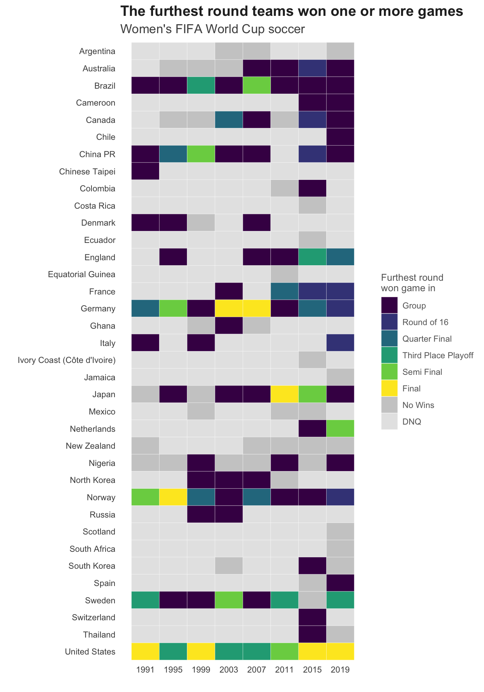

Women’s World Cup Soccer
================
Nancy Huynh
2019-07-09

-   [Women’s World Cup Soccer](#womens-world-cup-soccer)
    -   [Libraries and Data import](#libraries-and-data-import)
    -   [For each World Cup, what's the furthest each team has won a round in?](#for-each-world-cup-whats-the-furthest-each-team-has-won-a-round-in)
    -   [Resources](#resources)

Women’s World Cup Soccer
========================

I'm not a big soccer fan and didn't follow the Women's World Cup finals at all, except for hearing about Canada's early loss and the US win. We'll get it next time Canada... From this one visualization I created, I've learned more about women's soccer than I've ever known. As usual the data comes from [\#TidyTuesday](https://github.com/rfordatascience/tidytuesday/tree/master/data/2019/2019-07-09) courtesy of [Simon Beaumont](https://twitter.com/SimonBeaumont04?lang=en)

Libraries and Data import
-------------------------

Just using the `tidyverse` this time, although I do call on one function from `viridisLite` to make the tile plot.

``` r
library(tidyverse)
wwc_outcomes <- readr::read_csv("https://raw.githubusercontent.com/rfordatascience/tidytuesday/master/data/2019/2019-07-09/wwc_outcomes.csv") %>%
  mutate(round = ordered(round, c("Group", "Round of 16", "Quarter Final", "Third Place Playoff", "Semi Final", "Final"))) 

codes <- readr::read_csv("https://raw.githubusercontent.com/rfordatascience/tidytuesday/master/data/2019/2019-07-09/codes.csv")
```

For each World Cup, what's the furthest each team has won a round in?
---------------------------------------------------------------------

Some teams don't qualify every year so I wanted to include that information as opposed to showing NA, which could be interpreted as different outcomes (i.e. no games won in that year).

``` r
dnq <- wwc_outcomes %>% 
  group_by(team, year) %>%
  summarise(n = n()) %>%
  ungroup() %>%
  complete(team, year) %>%
  filter(is.na(n)) %>%
  select(-n) %>%
  mutate(best_win = "DNQ")
```

First I start off by finding the furthest round in each year's tournament teams won one or more games. Then I add in data frame `dnq` which has all the years that teams did not qualify for the World Cup, any remaining combinations of teams and years would be years where they did not win any games.

``` r
wwc_outcomes %>%
  filter(win_status == "Won") %>%
  group_by(team, year) %>%
  summarise(best_win = max(round)) %>%
  ungroup() %>% 
  bind_rows(dnq) %>%
  complete(team, year, fill = list(best_win = "No Wins")) %>%
  mutate(best_win = ordered(best_win, c("Group", "Round of 16", "Quarter Final", "Third Place Playoff", "Semi Final", "Final", "No Wins", "DNQ"))) %>% 
  left_join(codes, by = "team") %>%
  ggplot(aes(x = year, y = fct_rev(country), fill = best_win)) +
  geom_tile(color = "white") +
  scale_x_continuous(breaks = seq(from = 1991, to = 2019, by = 4)) +
  scale_fill_manual(values = c(viridisLite::viridis(6, option = "D"), "grey80", "grey90"), name = "Furthest round\nwon game in") +
  labs(x = "",
       y = "",
       title = "The furthest round teams won one or more games",
       subtitle = "Women's FIFA World Cup soccer") +
  nh_theme +
  theme(axis.ticks = element_blank())
```

    ## Warning in bind_rows_(x, .id): binding factor and character vector,
    ## coercing into character vector

    ## Warning in bind_rows_(x, .id): binding character and factor vector,
    ## coercing into character vector



Resources
---------

-   The `complete` function from `tidyr` came in handy this time, for more details see the [tidyr documentation](https://tidyr.tidyverse.org/reference/complete.html)
-   I've come to really like the viridis color palettes so the `viridisLite` package came in really handy, I learned more about it from [Thinking on Data](https://www.thinkingondata.com/something-about-viridis-library/)
